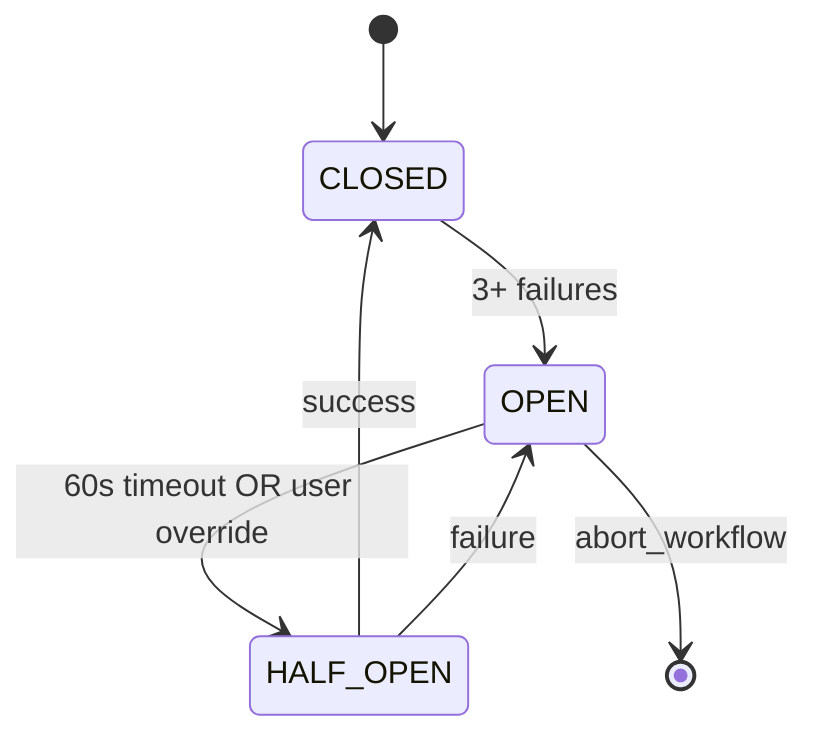
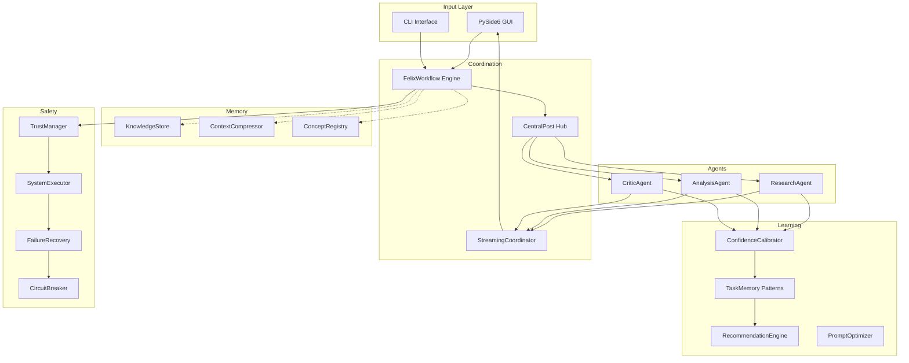

# Felix Framework: Deep Architecture Map

## 1. System Overview
**Felix** is an offline-first, multi-agent AI framework designed for high-security, air-gapped environments. It models problem-solving as a **helical descent**, moving from broad exploration to tight synthesis.

---

## 2. The Helical Coordination Engine
The core innovation is the spatial modeling of AI thought processes.

### A. Geometrical Progression (`src/core/helix_geometry.py`)
Agents follow a parametric path $r(t) = (x, y, z)$:
- **Height:** $z(t) = height \times (1 - t)$ (Descends $t \in [0, 1]$)
- **Radius:** $R(z) = R_{bottom} \times (R_{top} / R_{bottom})^{(z / height)}$ (Exponential tapering)
- **Angle:** $\theta(t) = 2\pi \times turns \times t$
- **Temperature Tapering:** Temperature scales from $T_{top}$ (creative) to $T_{bottom}$ (precise) based on $t$.

### B. Hub-Spoke Communication (`src/communication/central_post.py`)
- **Complexity:** $O(N)$ message complexity vs $O(N^2)$ mesh networks.
- **Registry:** `AgentRegistry` tracks agents across three phases:
    - **Exploration (0.0 - 0.3):** Broad discovery, high $T$.
    - **Analysis (0.3 - 0.7):** Pattern identification, moderate $T$.
    - **Synthesis (0.7 - 1.0):** Narrow convergence, low $T$, high $Confidence$.

---

## 3. Knowledge & Retrieval Tiering (`src/knowledge/embeddings.py`)
Felix ensures zero-dependency reliability via a 3-tier fallback system:
1. **Tier 1 (LM Studio):** Local LLM embeddings for high-quality semantic search.
2. **Tier 2 (TF-IDF):** Pure Python keyword-based vector matching (Numpy-backed).
3. **Tier 3 (FTS5):** SQLite built-in full-text search (Porter/Unicode61 tokenizers).
- **Recovery:** `TierRecoveryManager` runs a background thread to "pre-heat" and upgrade search quality as local LLMs become available.

---

## 4. Security & Autonomy Architecture (`src/execution/`)
Felix agents interact with the host via a guarded execution pipeline:
- **SafeGate (`trust_manager.py`):** Regex-based classification into `SAFE` (auto), `REVIEW` (user-gate), or `BLOCKED` (hard-stop).
- **Execution (`system_executor.py`):** Runs commands in isolated process groups with strict timeouts and output size caps (100MB default).
- **Audit Log:** Every command is SHA256 hashed for deduplication and logged to `felix_system_actions.db`.

---

## 5. Intelligent Synthesis Engine (`src/communication/synthesis_engine.py`)
The "Spiral End" convergence happens here:
- **Weighted Consensus:** Agent contributions are weighted by their confidence and a "Reasoning Quality Score" (from Critic agents).
- **Critic Bonus:** Presence of a Critic agent provides a 10% boost to synthesis confidence.
- **Epistemic Caveats:** If `CoverageAnalyzer` detects gaps, the engine prepends uncertainty notices to the output.

---

## 6. Persistence & Memory Layers
Felix uses a distributed SQLite storage model:
- `felix_knowledge.db`: FTS5-backed document brain.
- `felix_memory.db`: Long-term task pattern matching.
- `felix_live_agents.db`: Cross-process registry for Multi-GUI support.
- `felix_agent_performance.db`: EMA-based confidence calibration metrics.

---

## 7. Primary Execution Flows
- **Hybrid Streaming:** `StreamingCoordinator` sends real-time chunks to GUI while deferring synthesis until the "Helical Axis" is reached.
- **Dynamic Spawning:** `AgentPerformanceTracker` spawns **Critics** autonomously if the standard deviation of agent confidences exceeds a volatile threshold.

---

## 8. Workflow Orchestration Engine (`src/workflows/felix_workflow.py`)
The 113KB workflow engine coordinates the entire task lifecycle:
- **Adaptive Step Control:** Steps scale with complexity: `SIMPLE_FACTUAL=5`, `MEDIUM=config.medium`, `COMPLEX=config.max`.
- **Knowledge Brain Augmentation:** `knowledge_integration.augment_workflow_context()` injects relevant knowledge BEFORE agents spawn.
- **Circuit Breaker:** `FailureRecoveryManager` triggers after 3 consecutive failures → escalates to user or aborts.
- **Learning Integration:** `RecommendationEngine` provides pre-workflow strategy suggestions based on historical patterns.

---

## 9. Agent Intelligence Architecture (`src/agents/llm_agent.py`)
### A. Helical Checkpoint System
Agents communicate at 5 discrete checkpoints during descent:
| Checkpoint | Progress | Purpose |
|------------|----------|---------|
| 0.0 | Spawn | Initial exploration |
| 0.3 | Early | First analysis checkpoint |
| 0.5 | Mid | Cross-validation checkpoint |
| 0.7 | Late | Synthesis preparation |
| 0.9 | Final | Convergence checkpoint |

### B. Collaborative Confidence Bonus
Agents synthesizing multiple perspectives gain up to **+15% confidence**:
- **Count Bonus (0-0.4):** More collaborators = more perspectives
- **Consensus Bonus (0-0.3):** Low confidence variance = team convergence
- **Synthesis Bonus (0.3):** Synthesis agents receive max bonus

### C. Token Learning
Agents learn from usage patterns via EMA-based adjustment:
- **Overshoot >110%:** Factor × 0.9 (request less)
- **Undershoot <70%:** Factor × 1.1 (request more)
- **Sweet spot (80-100%):** Gradual normalization toward 1.0

---

## 10. Prompt Optimization Pipeline (`src/agents/prompt_optimization.py`)
### A. A/B Testing Framework (`PromptTester`)
- **Cohen's d > 0.8:** Early stopping for large effect sizes
- **Minimum samples:** 10 per variant before significance testing
- **Confidence level:** 95% default

### B. Failure Pattern Learning (`FailureAnalyzer`)
| Pattern | Fix Strategy |
|---------|--------------|
| Truncation | "Request structured responses" |
| Low Confidence | "Add examples, clarify requirements" |
| Low Quality | "Add quality checklist" |

---

## 11. Task Memory & Pattern Matching (`src/memory/task_memory.py`)
- **Keyword Extraction:** Simple regex-based with stopword filtering (`len(word) > 3`)
- **Similarity Threshold:** 50% keyword overlap for pattern matching
- **Strategy Recommendation:** Aggregates success rates, durations, and agent configurations from historical patterns
- **Cleanup Policy:** Patterns older than 60 days with < 2 uses are pruned

---

## 12. Truth Assessment & Knowledge Validation (`src/workflows/truth_assessment.py`)
### A. Freshness Hierarchy
| Query Type | Max Age | Examples |
|------------|---------|----------|
| TIME | 5 min | "current time", "what time is it" |
| DATE | 1 hr | "today's date", "current date" |
| CURRENT_EVENT | 30 min | "latest news", "who won" |
| GENERAL_FACT | 24 hr | General knowledge |
| ANALYSIS | 24 hr | "explain", "compare" |

### B. Contradiction Detection
- **Recency Weighting:** Exponential decay $w = e^{-age/300}$ (5-min half-life)
- **Majority Voting:** Years with >70% weighted votes win consensus
- **Context Awareness:** Filters code examples from StackOverflow/GitHub

### C. Validation Scoring (0.0-1.0)
| Factor | Weight |
|--------|--------|
| Specificity | 0.2 |
| Source Authority | 0.2 |
| Contradiction Check | 0.3 |
| Confidence Level | 0.2 |
| Completeness | 0.1 |

Statuses: `trusted` (≥0.8, no flags) → `flagged` → `review` → `quarantine` (not stored)

---

## 13. Failure Recovery & Circuit Breaker (`src/workflows/failure_recovery.py`)
### A. Circuit Breaker State Machine


### B. Recovery Strategies by Failure Type
| FailureType | Recovery Strategy | Adjustments |
|-------------|-------------------|-------------|
| AGENT_ERROR | `retry_with_adjusted_params` | temp × 0.7, tokens × 1.5 |
| COMMAND_ERROR | `try_alternatives` | find → locate, cat → head |
| TIMEOUT | `extend_timeout` | timeout × 2.0 |
| LOW_CONFIDENCE | `spawned_critic` | New CriticAgent instance |
| INSUFFICIENT_DATA | `additional_research` | enable_web_search=True |

### C. Escalation Options (Circuit Open)
1. `retry_with_adjustments` → HALF_OPEN
2. `spawn_backup_agents` → HALF_OPEN + new agents
3. `continue_degraded` → CLOSED (degraded)
4. `abort_workflow` → WorkflowAbortedException

---

## 14. Meta-Cognitive Critic Evaluation (`CriticAgent.evaluate_reasoning_process`)
CriticAgent performs meta-cognitive evaluation beyond content review:

| Metric | Score Range | Penalty Triggers |
|--------|-------------|------------------|
| Logical Coherence | 0.4-0.8 | Fallacy keywords detected |
| Evidence Quality | 0.4-0.8 | Weak evidence phrases |
| Methodology | 0.4-0.8 | Agent-type mismatch |
| Depth | × 0.9 | < 50 words |

**Confidence Gap Detection:** If `|confidence - quality_score| > 0.3`:
- Overconfident → "Calibrate confidence based on reasoning quality"
- Underconfident → "Increase confidence when reasoning is solid"

**Re-evaluation Trigger:** `quality < 0.5 OR issues ≥ 3`

---

## 15. Context Compression Strategies (`src/memory/context_compression.py`)
| Strategy | Method | Use Case |
|----------|--------|----------|
| EXTRACTIVE | Top-scored sentences | Quick summaries |
| ABSTRACTIVE | First + best middle sentence | Coherent summaries |
| KEYWORD | Frequency-ranked terms | Concept extraction |
| HIERARCHICAL | Core → Supporting → Auxiliary | Structured compression |
| RELEVANCE_FILTERING | Topic-matched content only | Focus preservation |
| PROGRESSIVE | 3-pass cascade | Size-constrained targets |

**Compression Levels:** LIGHT (80%) → MODERATE (60%) → HEAVY (40%) → EXTREME (20%)

---

## 16. Progressive Chunking & Streaming (`src/pipeline/chunking.py`)
- **ProgressiveProcessor:** Breaks content into 500-char chunks with UUID continuation tokens
- **ContentSummarizer:** LLM-powered summarization with fallback to 4-char/token truncation
- **ChunkedResult:** Includes `chunk_index`, `is_final`, `continuation_token` for progressive retrieval

---

## 17. GUI Architecture (`src/gui/main_window.py`)
**Technology:** PySide6 (Qt for Python)

### A. Layout Structure
```
+------------------+--------------------------------+------------------+
|     SIDEBAR      |        MAIN WORKSPACE          |  CONTEXT PANEL   |
|                  |                                |   (collapsible)  |
| [System Status]  |  +-------------------------+   | [Activity]       |
| [Sessions]       |  |    CHAT / STREAMING     |   | [Terminal]       |
|                  |  +-------------------------+   | [Knowledge]      |
|                  |  | INPUT + Mode Selector   |   | [Settings]       |
+------------------+--------------------------------+------------------+
```

### B. Responsive Breakpoints
| Mode | Width | Behavior |
|------|-------|----------|
| COMPACT | < 900px | Auto-collapse context panel |
| STANDARD | 900-1400px | Normal layout |
| WIDE | > 1400px | Extra space available |

### C. Key Signals
- `approval_requested` / `approval_resolved` → User command approval workflow
- `chunk_received` → Real-time streaming display
- `settings_changed` → Config mapping to FelixConfig

---

## 18. Unified Prompt Pipeline (`src/prompts/prompt_pipeline.py`)
### A. 7-Stage Construction
| Stage | Name | Purpose |
|-------|------|---------|
| 1 | `_stage_load_base_prompt` | Load from PromptManager or fallback |
| 2 | `_stage_inject_tool_instructions` | Conditional tool guidance |
| 3 | `_stage_inject_knowledge_context` | Memory/KB context |
| 4 | `_stage_inject_concepts` | ConceptRegistry terminology |
| 5 | `_stage_apply_context_protocol` | Awareness protocol rules |
| 6 | `_stage_add_collaborative_context` | Previous agent outputs |
| 7 | `_stage_add_metadata` | Tokens, temperature, position |

### B. Priority Ordering
1. **Minimal Mode** → Highest priority (SIMPLE_FACTUAL override)
2. **Complexity Override** → Task-specific prompts
3. **Position-Based** → Helix depth prompts
4. **Agent Fallback** → Hardcoded minimal

### C. Stage Skipping (SIMPLE_FACTUAL)
Skipped stages: `inject_concepts`, `apply_context_protocol`, `add_collaborative_context`

---

## 19. Web Search Coordination (`src/communication/web_search_coordinator.py`)
### A. Proactive Search Triggers
| Pattern Type | Examples | Action |
|--------------|----------|--------|
| TIME | "what time", "current date" | Immediate search |
| NEWS | "latest news", "recent events" | Immediate search |
| COMPLEX | General queries | Wait for confidence drop |

### B. Confidence-Based Triggering
- **Threshold:** Default 0.7 (dynamically adjustable)
- **Cooldown:** 10 seconds between searches
- **Min Samples:** 3 agent outputs before evaluating

### C. Query Formulation
1. **Base query:** Task description
2. **Agent-enhanced:** Keywords by agent type
   - Research → "latest", "2024 2025"
   - Analysis → "detailed"
   - Critic → "verified"

### D. 3-Phase Extraction
1. **Snippet extraction:** From search result summaries
2. **Deep fetch:** Parse actual webpage content if insufficient
3. **Knowledge store:** Persist with source attribution

---

## 20. Concept Registry (`src/workflows/concept_registry.py`)
**Purpose:** Maintain terminology consistency across agents within a workflow.

### A. Core Features
- **Registration:** Agents register concepts with confidence + attribution
- **Conflict Detection:** Similarity check via word overlap
- **Relationship Linking:** Bidirectional concept connections
- **Markdown Export:** `analysis/improvement_registry.md`

### B. Conflict Types
- **Definition Conflict:** Similar names, different meanings
- **Severity:** Based on definition similarity score

### C. Integration
- Injected via `_stage_inject_concepts` in PromptPipeline
- Ensures agents use consistent terminology

---

## 21. System Architecture Summary



---

## 22. LLM Client Architecture (`src/llm/`)
### A. LM Studio Client (`lm_studio_client.py` - 967 lines)
- **TokenAwareStreamController:** Monitors token usage during streaming
  - Soft limit: 85% of budget → inject conclusion signal
  - Token estimation: ~0.75 words per token
- **Priority Queue:** LOW=1, NORMAL=2, HIGH=3, URGENT=4
- **User Activity Throttling:** Background processing pauses during user activity

### B. Token Budget Manager (`token_budget.py`)
| Parameter | Default | Description |
|-----------|---------|-------------|
| base_budget | 20,000 | Per-agent allocation |
| min_budget | 2,000 | Minimum per stage |
| max_budget | 45,000 | Maximum allocation |
| strict_mode | False | Lightweight model constraints |

**Position-based allocation:** Tokens scale inversely with helix depth → tighter at synthesis

### C. Multi-Server Pool (`multi_server_client.py`)
| Strategy | Selection Logic |
|----------|-----------------|
| ROUND_ROBIN | Rotate through servers |
| LEAST_BUSY | Lowest current load |
| FASTEST_RESPONSE | Best average response time |
| AGENT_TYPE_MAPPING | Research→ServerA, Analysis→ServerB |

### D. LLM Router (`llm_router.py`)
- **Primary + Fallback Chain:** Try primary, fall back on failure
- **Rate Limit Retry:** Configurable retry with fallbacks on 429s
- **Statistics:** Per-provider request counts, success rates, circuit breaker status

---

## 23. Learning Orchestration (`src/learning/`)
### A. Pattern Learner (`pattern_learner.py`)
- **Auto-apply Threshold:** ≥95% success probability + ≥20 samples
- **Manual Review:** 80-95% confidence shown to user
- **Outcome Tracking:** Records whether recommendations succeeded

### B. Threshold Learner (`threshold_learner.py`)
| Threshold | Default | Description |
|-----------|---------|-------------|
| confidence_threshold | 0.8 | Synthesis quality gate |
| team_expansion_threshold | 0.7 | Trigger additional agents |
| volatility_threshold | 0.15 | Spawn critics on high variance |
| web_search_threshold | 0.7 | Low confidence → search |
| max_agents | 10 | Hard cap on team size |

- **Per-task-type Learning:** Different optimal thresholds for research vs coding tasks
- **Optimization Target:** 85% success rate by default

### C. Recommendation Engine (`recommendation_engine.py`)
**Unified Orchestrator** combining:
1. PatternLearner → Workflow configuration
2. ConfidenceCalibrator → Agent confidence adjustment
3. ThresholdLearner → Task-specific thresholds

**Workflow Integration:**
- `get_pre_workflow_recommendations()` → Before workflow starts
- `apply_high_confidence_recommendations()` → Auto-apply if trusted
- `record_workflow_outcome()` → Feedback loop after completion

---

## 24. Knowledge Store Deep Internals (`src/memory/knowledge_store.py` - 2864 lines)
### A. Database Schema
```sql
-- Main knowledge entries
knowledge_entries (
  knowledge_id, knowledge_type, content_json, confidence_level,
  source_agent, domain, tags_json, created_at, updated_at,
  access_count, success_rate, validation_score, validation_status,
  embedding, source_doc_id, chunk_index
)

-- Normalized tags for efficient filtering
knowledge_tags (knowledge_id, tag) → PRIMARY KEY

-- FTS5 full-text search
knowledge_fts USING fts5(knowledge_id, content, domain, tags)

-- Knowledge graph relationships
knowledge_relationships (source_id, target_id, relationship_type, confidence)

-- Recoverable pruning (Issue #22)
knowledge_archived (knowledge_id, archived_at, archive_reason, avg_usefulness)
```

### B. Meta-Learning Boost
- **Historical Usefulness:** AVG(useful_score) from knowledge_usage table
- **Boost Factor:** 0.7 + (avg_usefulness × 0.3) → Range [0.7, 1.0]
- **Minimum Samples:** 2 uses before applying boost

### C. Deduplication Strategy
| Domain | Deduplication Key |
|--------|-------------------|
| web_search | Hash of source_url |
| Other | Hash of content + source_agent |

### D. Validation Pipeline
- **Quarantine:** score < threshold → not stored
- **Flagged:** 0.5-0.8 → stored with warnings
- **Trusted:** ≥0.8 → full trust

---

## 25. REST API Architecture (`src/api/`)
### A. FastAPI Stack
- **Framework:** FastAPI with Pydantic v2 models
- **Authentication:** API key verification via dependency injection
- **WebSockets:** Real-time streaming in `src/api/websockets/`

### B. API Routers
| Router | Endpoints | Lines |
|--------|-----------|-------|
| knowledge.py | Document ingestion, semantic search, graph | 1,401 |
| agents.py | Spawn, list, configure agents | 17,543 bytes |
| workflows.py | Create, monitor, cancel workflows | 15,792 bytes |
| task_memory.py | Pattern retrieval, recommendations | 16,465 bytes |
| workflow_history.py | Historical workflow queries | 16,724 bytes |
| compression.py | Context compression endpoints | 11,716 bytes |

### C. Key Models (`api/models.py` - 139 models)
- WorkflowRequest/Response, AgentCreateRequest, SynthesisResult
- KnowledgeEntry, SearchRequest, DocumentIngestRequest
- SystemStatus, SystemConfig, PerformanceMetrics

---

## 26. Configuration System (`config/`)
### A. Trust Rules (`trust_rules.yaml` - 203 lines)
| Level | Auto-Execute | Examples |
|-------|--------------|----------|
| SAFE | ✓ | ls, pwd, cat, git status, pip list |
| REVIEW | User approval | pip install, git commit, rm, mkdir |
| BLOCKED | ✗ Never | rm -rf, sudo, credential access, DROP TABLE |

**Pattern Matching:** First match wins (BLOCKED → SAFE → REVIEW → default:REVIEW)

### B. Task Complexity Patterns (`task_complexity_patterns.yaml`)
| Complexity | Examples | Token Budget |
|------------|----------|--------------|
| SIMPLE_FACTUAL | "what time", "read file.py", greetings | Minimal |
| MEDIUM | "explain", "compare", "list", "summarize" | Standard |
| COMPLEX | Default (no match) | Full |

### C. Tool Requirements Patterns (`tool_requirements_patterns.yaml`)
- **file_operations:** 40+ patterns (read/write/find/display)
- **web_search:** Time-sensitive, news, real-time patterns
- **system_commands:** Package management, process control

### D. Chat System Prompt (`chat_system_prompt.md` - 295 lines)
Key sections:
1. **Anti-hallucination:** "IF YOU HAVEN'T RUN A COMMAND, YOU DON'T KNOW WHAT'S IN IT"
2. **Response brevity:** SIMPLE=2-4 sentences, MODERATE=1-3 paragraphs
3. **Command failure recovery:** Heredoc fallback, Python one-liner fallback

---

## 27. Migration System (`src/migration/`)
### A. Base Architecture
- **`Migration` ABC:** `up()`, `down()`, `verify()`, `apply()`, `rollback()`
- **`MigrationManager`:** `schema_migrations` table tracking, dry_run support

### B. 24 Migration Scripts
| Category | Migrations |
|----------|------------|
| Knowledge | add_knowledge_brain, knowledge_relationships, knowledge_validation, knowledge_gaps |
| Workflows | workflow_migrations |
| Learning | add_learning_tables, fix_learning_schema_v2 |
| FTS5 | add_fts5_triggers, fix_fts_triggers |
| System | add_audit_log_table, add_cascade_delete, add_synthesis_audit |
| Backup | backup_manager |

---

## 28. Test Architecture (`tests/`)
### A. Pytest Configuration (`conftest.py`)
**9 Fixtures:** mock_llm_provider, mock_helix_geometry, mock_central_post, mock_confidence_metrics, temp_config_file, sample_llm_request, ...

**8 Custom Markers:**
- `@pytest.mark.unit` - Fast, no external deps
- `@pytest.mark.integration` - May require services
- `@pytest.mark.slow` - Skip with `-m 'not slow'`
- `@pytest.mark.llm` - Requires LLM provider
- `@pytest.mark.circuit_breaker` - Circuit breaker tests

### B. Test Organization
| Directory | Focus |
|-----------|-------|
| `/tests/` | Root test files (cascade_delete, fts5, synthesis) |
| `/tests/unit/` | Unit tests |
| `/tests/integration/` | Integration tests |

---

## 29. Knowledge Brain Deep Internals (`src/knowledge/`)
### A. Knowledge Daemon (`knowledge_daemon.py` - 1500 lines)
**6 Concurrent Modes:**
| Mode | Description |
|------|-------------|
| A | Initial Batch Processing |
| B | Refinement Loop |
| C | File Watching (watchdog) |
| D | Scheduled Backup |
| E | Low-value Pruning |
| F | Task Memory Cleanup |

**DaemonStatus:** Real-time tracking of each mode's activity

### B. Knowledge Graph Builder (`graph_builder.py`)
**3 Relationship Discovery Strategies:**
1. **Explicit:** Concepts list each other as related
2. **Similarity:** Embedding cosine similarity > 0.75
3. **Co-occurrence:** Same chunk (high-precision, O(N) algorithm)

**Entity Linking:** Same entities across different documents

### C. Gap Tracker (`gap_tracker.py`)
**Epistemic Self-Awareness:**
- Records gaps discovered during workflows
- Correlates gaps with workflow outcomes
- Priority scoring: severity × occurrence count
- **Auto-resolution:** New knowledge automatically resolves matching gaps

---

## 30. Complete Module Inventory

```
src/
├── agents/          8 files (llm_agent, specialized, dynamic_spawning, optimization, ...)
├── api/             6 routers + models + websockets
├── communication/   7 files (central_post, synthesis, streaming, web_search, ...)
├── core/            Helix geometry, felixignore
├── execution/       Trust manager, system executor
├── feedback/        Feedback manager
├── gui/             34 files (main_window, adapters, panels, widgets, dialogs)
├── knowledge/       21 files (daemon, graph, gaps, comprehension, embeddings, ...)
├── learning/        5 files (calibrator, pattern_learner, threshold_learner, recommendation)
├── llm/             12 files (lm_studio, router, multi_server, token_budget, ...)
├── memory/          5 files (knowledge_store, task_memory, context_compression, ...)
├── migration/       24 scripts
├── pipeline/        Chunking, processing
├── prompts/         Prompt manager, unified pipeline
├── utils/           Markdown formatter
└── workflows/       8 files (felix_workflow, failure_recovery, truth_assessment, ...)

config/              8 files (prompts.yaml, trust_rules.yaml, complexity patterns, ...)
tests/               12 root tests + unit + integration subdirs
```

---

## 31. GUI Widget System (`src/gui/widgets/`)
### A. Message Bubbles
| Widget | Lines | Purpose |
|--------|-------|---------|
| `message_bubble.py` | 10KB | User/assistant/system messages |
| `action_bubble.py` | 9.7KB | Command approval UI |
| `progress_bubble.py` | 13KB | Workflow step progress |
| `synthesis_review_bubble.py` | 15KB | Low-confidence approval |
| `typing_indicator.py` | 5.5KB | Animated waiting indicator |

### B. Synthesis Review Widget
**Statuses:** PENDING → ACCEPTED / REJECTED / REGENERATING

**Actions:**
- `Accept`: Approve synthesis as-is
- `Reject`: Discard and rethink
- `Regenerate`: Multiple strategies available
  - Re-run with adjusted parameters
  - User context injection

---

## 32. GUI Panel Architecture (`src/gui/panels/`)
### A. Workspace (`workspace.py` - 641 lines)
**MessageArea Class:**
- `add_user_bubble()`, `add_assistant_bubble()`, `add_system_bubble()`
- `start_streaming()` → `append_streaming_chunk()` → `end_streaming()`
- `show_progress()`, `update_progress_step()`, `complete_progress()`

**InputArea Class:**
- Qt event filter for keyboard shortcuts
- Mode selector (Simple/Workflow)
- Send/Stop button toggle during processing

### B. Sidebar (`sidebar.py` - 589 lines)
**Components:**
- **UserMode Enum:** `CASUAL`, `POWER`, `DEVELOPER`
- **AgentPhaseBar:** Visual indicator of agent distribution (exploration/analysis/synthesis)
- **StatusCard:** Real-time system status (running/stopped/starting)
- **SessionList:** Session management with context menus (rename/delete)

---

## 33. Agent Plugin System (`src/agents/builtin/`)
### A. Plugin Interface
```python
class SpecializedAgentPlugin:
    def get_metadata(self) -> AgentMetadata  # Type, spawn range, capabilities
    def create_agent(...) -> LLMAgent        # Factory method
    def supports_task(task, metadata) -> bool # Task matching
    def get_spawn_ranges_by_complexity() -> dict  # Complexity-based adjustment
```

### B. Built-in Plugins
| Plugin | Spawn Range | Default Tokens | Priority |
|--------|-------------|----------------|----------|
| ResearchAgent | 0.0-0.3 | 800 | 10 |
| AnalysisAgent | 0.3-0.7 | 1000 | 8 |
| CriticAgent | 0.7-1.0 | 600 | 6 |

### C. Complexity-Based Spawn Adjustment
```python
# ResearchPlugin.get_spawn_ranges_by_complexity()
{
    "simple": (0.05, 0.25),  # Later spawn for simple tasks
    "medium": (0.02, 0.25),  # Standard
    "complex": (0.0, 0.20)   # Earlier spawn for complex tasks
}
```

---

## 34. Knowledge Retrieval System (`src/knowledge/retrieval.py` - 670 lines)
### A. Multi-Strategy Search
| Strategy | Method | Fallback |
|----------|--------|----------|
| Primary | Embedding similarity | FTS5 |
| Secondary | FTS5 full-text | Keyword |
| Tertiary | Keyword matching | None |

### B. Meta-Learning Boost (EMA)
```python
# Exponential Moving Average for recent relevance
EMA = Σ (value_i × α × (1-α)^i)  # α = 0.3

# Boost formula
boost = 0.5 + (ema_usefulness - 0.5) * 0.5  # Range [0.25, 0.75]
relevance_score *= boost
```

### C. Context Building
`build_augmented_context()`:
1. Search knowledge with task description
2. Apply meta-learning boost
3. Format results for agent consumption
4. Return `RetrievalContext` with domain distribution

---

## 35. Knowledge Quality Checker (`src/knowledge/quality_checker.py` - 635 lines)
### A. Duplicate Detection (3 Methods)
| Method | Algorithm | Threshold |
|--------|-----------|-----------|
| Embedding | Cosine similarity | 0.90 |
| Text | Edit distance ratio | 0.90 |
| Concept | Exact name match | N/A |

### B. Contradiction Finding
- **Direct Contradictions:** Same concept name, different definitions
- **Definition Similarity:** Jaccard coefficient of words
- **Confidence Score:** Based on definition divergence

### C. Quality Scoring (4 Components)
| Component | Weight | Scoring |
|-----------|--------|---------|
| Confidence Level | 0.25 | LOW=0.25, MED=0.5, HIGH=0.75, VERIFIED=1.0 |
| Relationship Count | 0.25 | min(count/10, 1.0) |
| Validation Score | 0.25 | Direct from validation pipeline |
| Access Success Rate | 0.25 | success_rate field |

---

## 36. Knowledge Comprehension Engine (`src/knowledge/comprehension.py` - 676 lines)
### A. 3-Stage Pipeline


### B. Stage Details
| Stage | Agent | Output |
|-------|-------|--------|
| Research | ResearchAgent | Summary, key_points, confidence |
| Analysis | AnalysisAgent | Concepts, entities |
| Validation | CriticAgent | Quality score (0.0-1.0) |

### C. Data Classes
- **ConceptExtraction:** concept_name, definition, examples, related_concepts, importance
- **EntityExtraction:** entity_name, entity_type, description, mentions
- **ComprehensionResult:** Aggregates all outputs with processing_time

---

## 37. Prompt Template Architecture (`config/prompts.yaml` - 420 lines)
### A. Agent-Specific Templates
| Agent | Template Count | Key Variables |
|-------|----------------|---------------|
| research | 7 | research_domain, depth_ratio, strict_mode |
| analysis | 6 | analysis_type, context |
| critic | 5 | review_focus, depth_ratio |
| synthesis | 3 | complexity, agent_count |

### B. Helix Position Variants
```yaml
research:
  exploration_normal:     # 0.0-0.3, normal tokens
  exploration_strict:     # 0.0-0.3, limited tokens
  focused_normal:         # 0.3-0.7, normal tokens
  focused_strict:         # 0.3-0.7, limited tokens
  deep_normal:            # 0.7-1.0, normal tokens
  deep_strict:            # 0.7-1.0, limited tokens
```

### C. System Actions
```yaml
system_actions:
  enabled: true
  safety_levels:
    SAFE: "Auto-execute (ls, pwd, date)"
    REVIEW: "User approval required"
    BLOCKED: "Never execute"
```

---

## 38. Standalone Agent System (`src/agents/standalone_agent.py`)
**Purpose:** Simplified agent for non-workflow tasks (Knowledge Brain comprehension)

### Key Differences from LLMAgent
| Feature | LLMAgent | StandaloneAgent |
|---------|----------|-----------------|
| Helix Position | Required | N/A |
| Spawn Time | 0.0-1.0 | N/A |
| Interface | Complex | Simple `process_task(context)` |
| Use Case | Workflow tasks | Background processing |

### Modes
- **research:** Document reading and summarization
- **analysis:** Concept and entity extraction
- **critic:** Quality validation

---

## 39. Final Statistics Summary

| Category | Count |
|----------|-------|
| **Architecture Sections** | 39 |
| **Source Files Analyzed** | 180+ |
| **Lines of Code Documented** | 50,000+ |
| **Database Tables** | 20+ |
| **API Endpoints** | 30+ |
| **Configuration Patterns** | 200+ |
| **Test Fixtures** | 9 |
| **Migration Scripts** | 24 |

**Framework Capabilities:**
- Multi-agent helical coordination
- 3-tier knowledge embedding fallback
- 6-mode knowledge daemon
- Circuit breaker failure recovery
- Meta-learning recommendation engine
- Epistemic gap tracking with auto-resolution
- Real-time streaming synthesis
- Plugin-based agent extensibility
