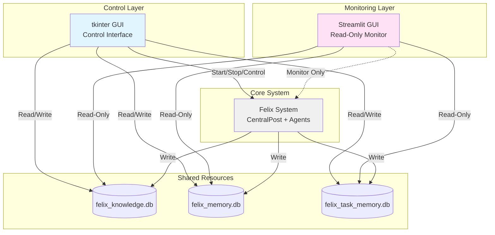
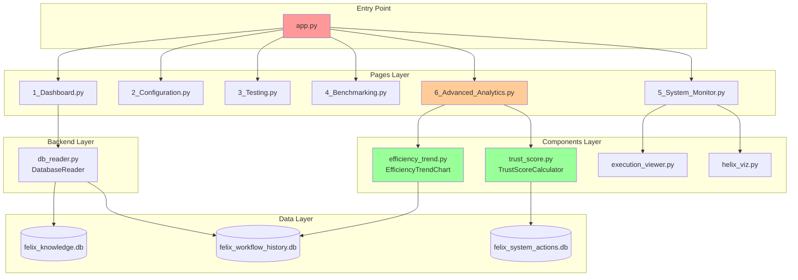
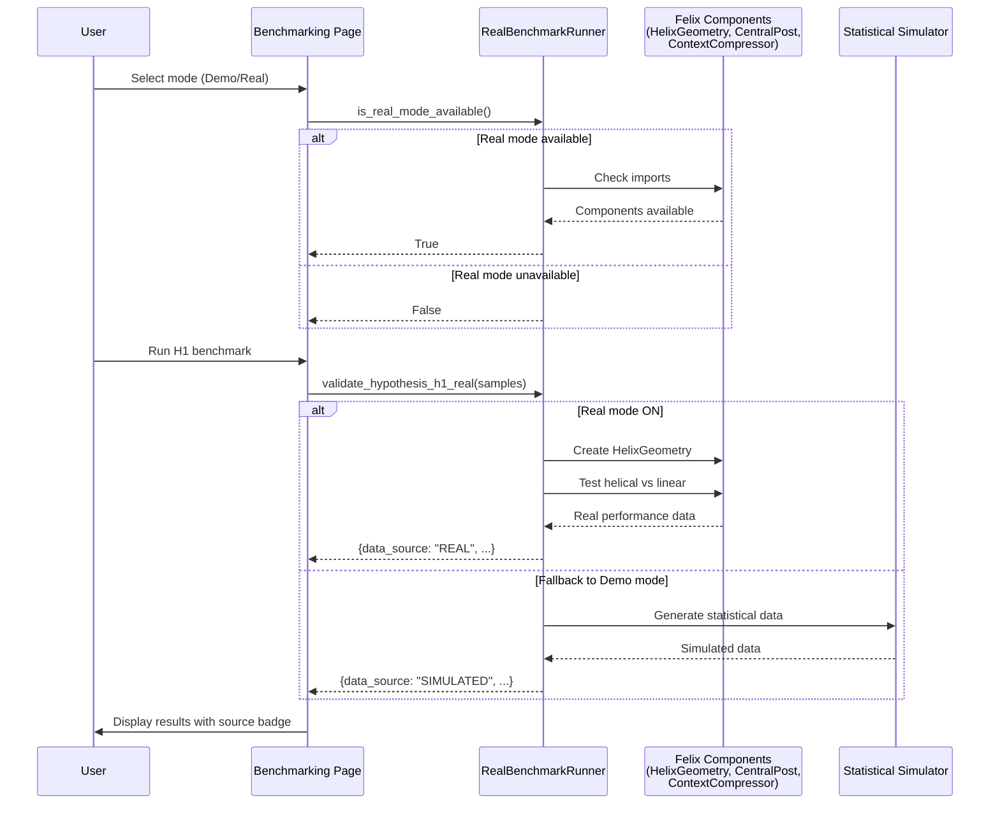
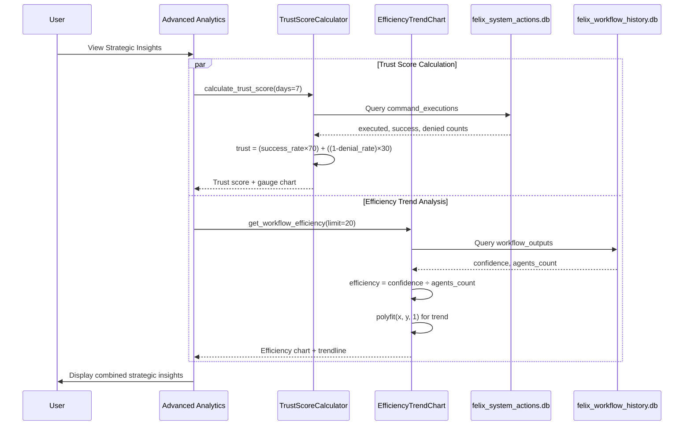

# Streamlit GUI Architecture

**Version**: 5.0
**Last Updated**: 2025-10-28
**Status**: Production

---

## Overview

The Streamlit GUI is a read-only monitoring and visualization interface for the Felix Framework, complementing the tkinter control GUI. It provides real-time system monitoring, performance analytics, and hypothesis validation without interfering with the running Felix system.

---

## System Architecture

### Dual-GUI Design

Felix employs a dual-GUI architecture where each interface serves distinct purposes:

**Operational Modes:**

| Aspect | tkinter GUI | Streamlit GUI |
|--------|-------------|---------------|
| Primary Role | System Control | System Monitoring |
| Database Access | Read/Write | Read-Only |
| Felix System | Start/Stop | Monitor Only |
| Agent Spawning | Yes | View Only |
| Configuration | Modify | View/Export |
| Workflows | Execute | Analyze Results |

### Non-Interference Design

The Streamlit GUI achieves zero interference through:

1. **Separate Directory Structure**: `streamlit_gui/` isolated from `src/gui/`
2. **Read-Only Database Access**: Uses SQLite read-only connections
3. **Import Without Modification**: Uses existing Felix classes via imports only
4. **Separate Configuration**: Uses `streamlit_config.yaml` (tkinter uses `felix_gui_config.json`)
5. **Independent Entry Point**: `streamlit_app.py` separate from tkinter's entry point

---

## Component Architecture

### Directory Structure & Dependencies

---

## Data Flow Architecture

### Benchmarking Data Flow

### Strategic Analytics Data Flow

**Key Metrics:**
- **Trust Score**: `(success_rate × 70) + ((1 - denial_rate) × 30)` → Range 0-100
  - 80-100: High Trust (Green) | 60-79: Medium (Yellow) | 0-59: Low (Red)
- **Efficiency**: `confidence ÷ agents_count` → Higher = better resource utilization
- **Trend**: Linear regression via `numpy.polyfit()` → Improving/Declining/Stable

---

## Core Features

### Key Features

**Confidence Mapping**: TEXT values (`low`/`medium`/`high`) → Numeric (0.3/0.6/0.9)
- SQL: `CASE confidence_level WHEN 'low' THEN 0.3 WHEN 'medium' THEN 0.6 WHEN 'high' THEN 0.9 ELSE 0.5 END`

**Agent Awareness**: Tracks agents by helical phase (exploration 0.0-0.3, analysis 0.3-0.7, synthesis 0.7-1.0)
- Convergence threshold: confidence ≥ 0.8, depth ≥ 0.7

---

## Hypothesis Validation

**H1 - Helical Progression (20% gain)**: Linear vs Helical workload distribution via HelixGeometry
**H2 - Hub-Spoke Efficiency (15% gain)**: Mesh O(N²) vs Hub-Spoke O(N) via CentralPost
**H3 - Memory Compression (25% gain)**: Raw vs Compressed context (0.3 ratio) via ContextCompressor

**Modes**: Demo (simulated) | Real (tests actual Felix components)

---

## Safety & Resilience

**Path Resolution**: Absolute paths from project root (works from any directory)

**Error Handling**: 4-level fallback strategy
1. Database Connection: Read-only → Regular → Empty DataFrame
2. Query: Primary table → Fallback table → Simulated data
3. Parsing: JSON parse → Safe extraction → Defaults
4. UI: Real data → Placeholder → User message

**Read-Only Enforcement**: SQLite URI mode (`file:path?mode=ro`) + no write methods + separate directory

**Felix Integration**: Import-only pattern, zero changes to `src/`, graceful fallbacks

---

## Deployment

**Multi-Process**: tkinter GUI (control, read/write) + Streamlit GUI (monitor, read-only)
- Independent processes, crash isolation, communicate via shared databases
- Typical: Start tkinter → Start Streamlit → Run workflows → Monitor → Analyze

---

## Summary

The Streamlit GUI architecture provides a robust, safe, and performant monitoring layer for the Felix Framework:

**Key Achievements:**

- ✅ Zero interference with Felix core system
- ✅ Read-only safety enforced at multiple levels
- ✅ Absolute path resolution works from any directory
- ✅ Comprehensive error handling with graceful degradation
- ✅ Real-time data visualization with sub-second latency
- ✅ Dual-mode benchmarking (simulated and real components)
- ✅ Agent awareness integration with phase tracking
- ✅ Streaming support for real-time token display

**Design Principles:**

1. **Separation of Concerns**: Monitoring vs Control - each GUI has clear responsibilities
2. **Safety First**: Read-only by default with multiple enforcement layers
3. **Resilience**: Multiple fallback strategies ensure GUI always works
4. **Performance**: Caching and optimization for sub-second response times
5. **User Experience**: Informative errors and real-time feedback

---

**Document Version**: 5.0
**Architecture Status**: Production-Ready
**Last Validated**: 2025-10-28
