# Streamlit GUI Architecture

**Version**: 4.1
**Last Updated**: 2025-10-22
**Status**: Production

---

## Overview

The Streamlit GUI is a read-only monitoring and visualization interface for the Felix Framework, complementing the tkinter control GUI. It provides real-time system monitoring, performance analytics, and hypothesis validation without interfering with the running Felix system.

---

## System Architecture

### Dual-GUI Design

Felix employs a dual-GUI architecture where each interface serves distinct purposes:

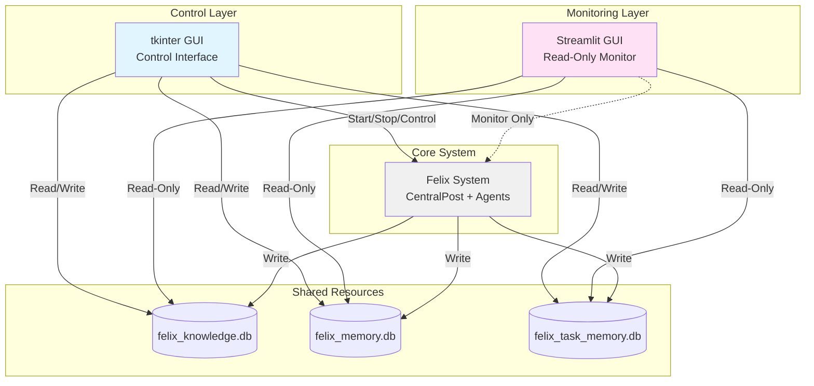

**Operational Modes:**

| Aspect | tkinter GUI | Streamlit GUI |
|--------|-------------|---------------|
| Primary Role | System Control | System Monitoring |
| Database Access | Read/Write | Read-Only |
| Felix System | Start/Stop | Monitor Only |
| Agent Spawning | Yes | View Only |
| Configuration | Modify | View/Export |
| Workflows | Execute | Analyze Results |

### Non-Interference Design

The Streamlit GUI achieves zero interference through:

1. **Separate Directory Structure**: `streamlit_gui/` isolated from `src/gui/`
2. **Read-Only Database Access**: Uses SQLite read-only connections
3. **Import Without Modification**: Uses existing Felix classes via imports only
4. **Separate Configuration**: Uses `streamlit_config.yaml` (tkinter uses `felix_gui_config.json`)
5. **Independent Entry Point**: `streamlit_app.py` separate from tkinter's entry point

---

## Component Architecture

### Directory Structure & Dependencies

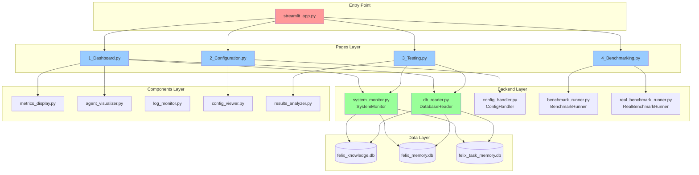

---

## Data Flow Architecture

### Dashboard Data Flow

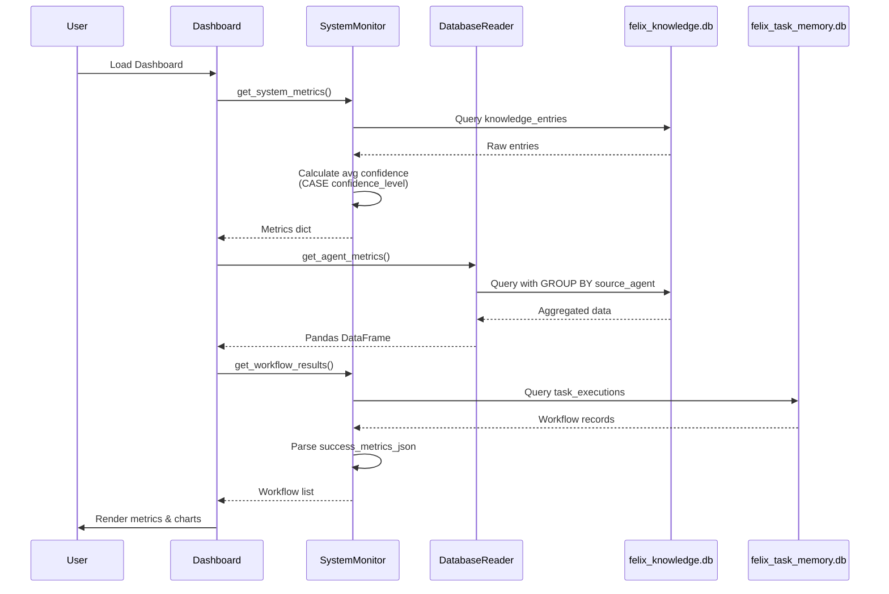

### Configuration Data Flow

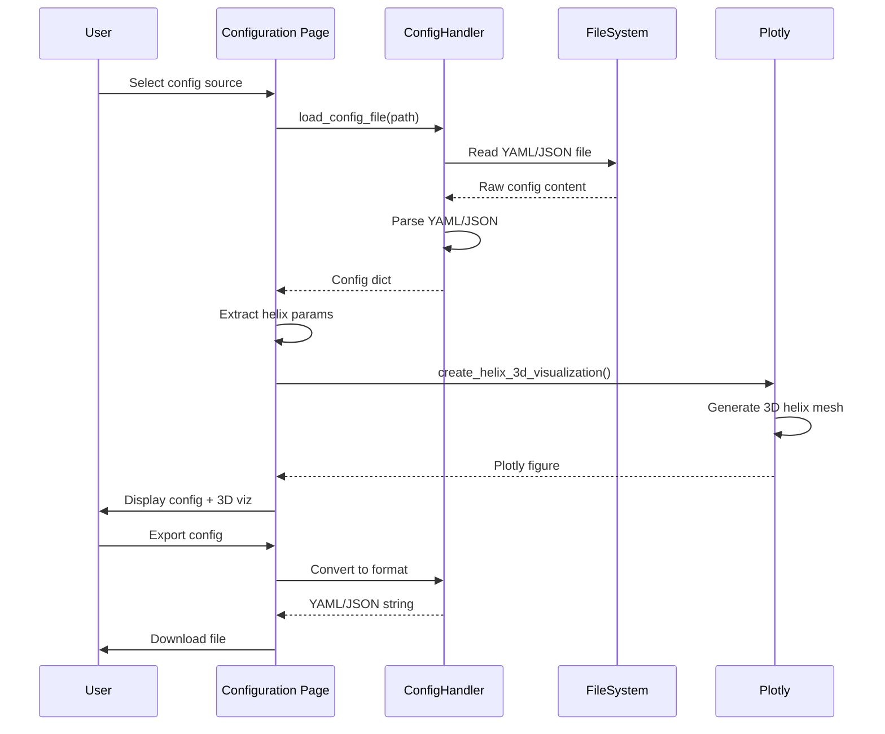

### Workflow Results Data Flow

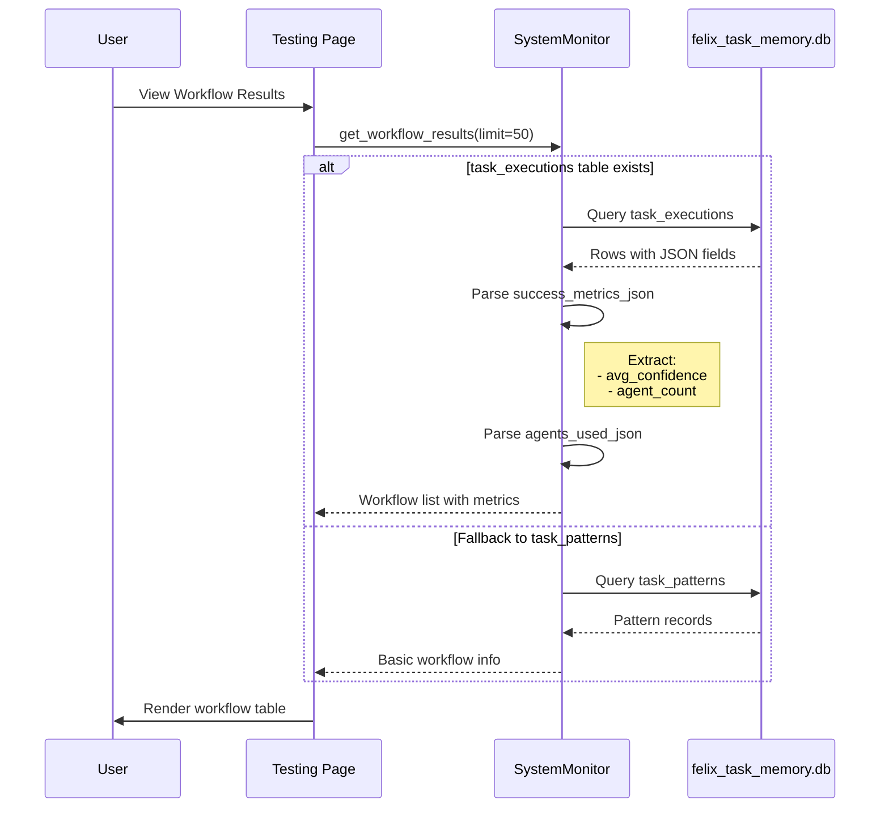

### Benchmarking Data Flow

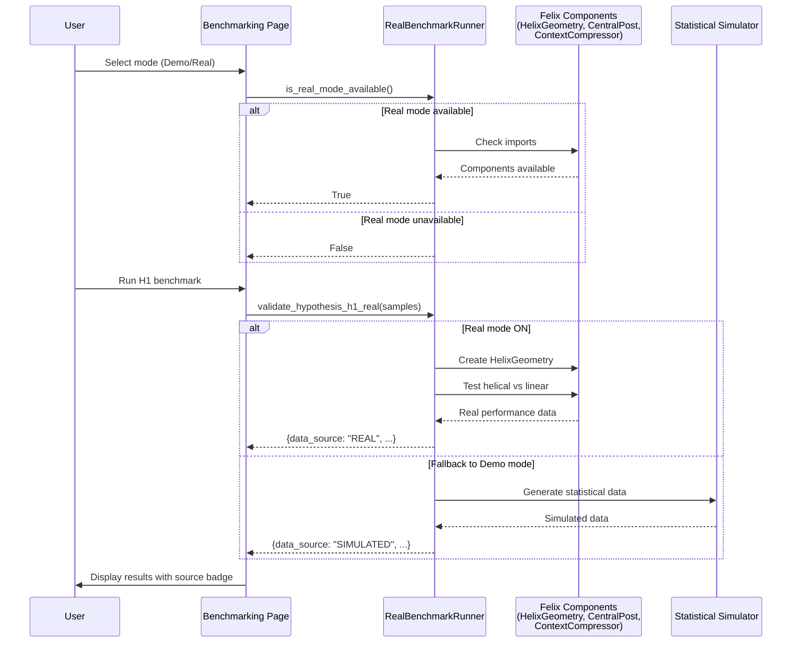

---

## Core Features

### Confidence Calculation

The system maps TEXT confidence levels to numeric values for meaningful chart visualization:

| Database Value | Numeric Value | Percentage |
|----------------|---------------|------------|
| `"low"` | 0.3 | 30% |
| `"medium"` | 0.6 | 60% |
| `"high"` | 0.9 | 90% |
| `NULL` / Other | 0.5 | 50% (default) |

**SQL Implementation:**
```sql
CASE confidence_level
    WHEN 'low' THEN 0.3
    WHEN 'medium' THEN 0.6
    WHEN 'high' THEN 0.9
    ELSE 0.5
END
```

This replaced the previous incorrect use of `success_rate` column (always 1.0), enabling realistic confidence visualization ranging from 30-90%.

### Agent Awareness

The system tracks agents by helical phase for monitoring convergence:

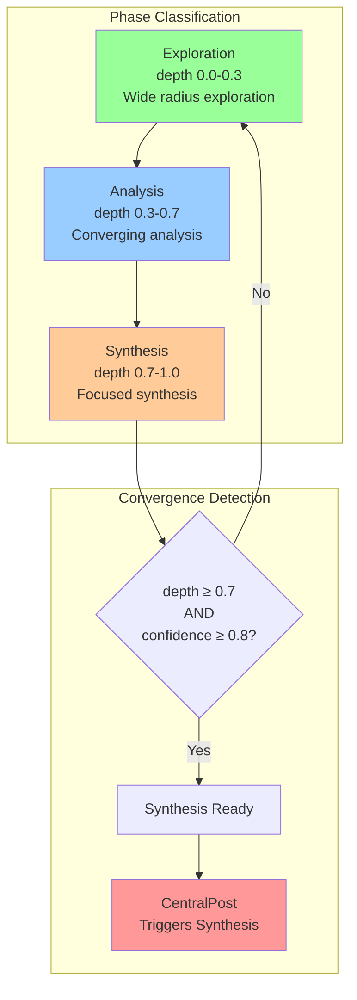

**Capabilities:**
- Monitor agents by helical phase (exploration/analysis/synthesis)
- Track convergence status (threshold: confidence ≥ 0.8, depth ≥ 0.7)
- Infer agent position from domain and activity patterns

### Incremental Token Streaming

Real-time token-by-token display for live agent output monitoring:

**Configuration:**
- `enable_streaming`: Boolean flag in FelixConfig
- `streaming_batch_interval`: Time between UI updates (default: 0.1s)
- Supports multiple concurrent streams from different agents

**Status Monitoring:**
```python
system_monitor.get_streaming_status()
# Returns: {
#     'enabled': bool,
#     'active_streams': int,
#     'partial_thoughts': [...]
# }
```

---

## Hypothesis Validation Architecture

### Combined Hypothesis Overview

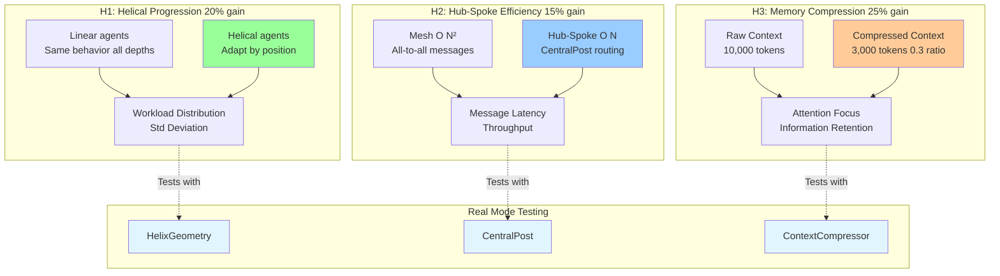

**Benchmark Modes:**
- **Demo Mode**: Simulated data using statistical models for quick demonstration
- **Real Mode**: Tests actual Felix components (HelixGeometry, CentralPost, ContextCompressor)
- Each result clearly labeled with data source (REAL vs SIMULATED)

---

## Safety & Resilience

### Path Resolution

Databases are located using absolute path resolution from any working directory:

```python
# Resolve project root from backend file location
backend_dir = os.path.dirname(os.path.abspath(__file__))
streamlit_gui_dir = os.path.dirname(backend_dir)
project_root = os.path.dirname(streamlit_gui_dir)

# Construct absolute paths
self.knowledge_db_path = os.path.join(project_root, "felix_knowledge.db")
self.memory_db_path = os.path.join(project_root, "felix_memory.db")
self.task_memory_db_path = os.path.join(project_root, "felix_task_memory.db")
```

**Benefits**: Works from any directory, consistent behavior, no relative path assumptions.

### Error Handling Strategy

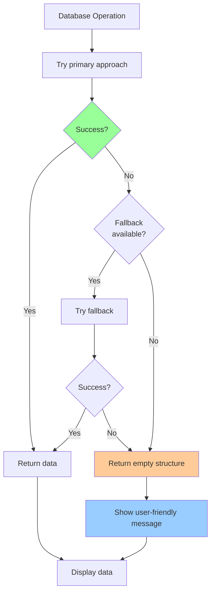

**Fallback Levels:**
1. **Database Connection**: Read-only mode → Regular connection → Empty DataFrame
2. **Query Execution**: Primary table → Fallback table → Simulated data
3. **Data Parsing**: JSON parse → Safe extraction → Default values
4. **UI Rendering**: Real data → Placeholder → User message

### Security & Integration

**Read-Only Enforcement:**
- SQLite read-only URI mode: `file:path?mode=ro` prevents writes at database level
- No write methods exposed in backend classes (no `insert()`, `update()`, `delete()`)
- Separate directory structure prevents accidental modification of control GUI
- Import-only pattern uses existing Felix classes without modification

**Felix Core Integration:**

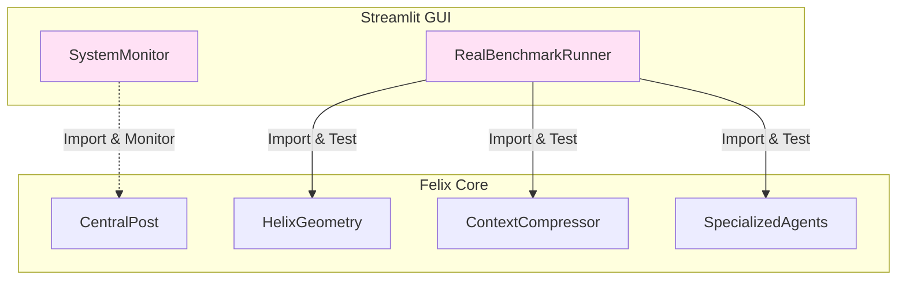

**Integration Principles:**
1. Zero changes to `src/` directory
2. Monitoring only (no control operations)
3. Real component testing when available
4. Graceful fallback to simulated data

---

## Deployment Architecture

### Multi-Process Operation

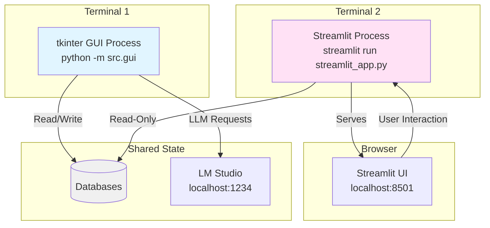

**Process Characteristics:**

- **Independent Processes**: Can start/stop independently without affecting each other
- **No Process Communication**: Communicate only via shared databases (no sockets/pipes)
- **Crash Isolation**: Streamlit crash doesn't affect tkinter GUI or Felix system
- **Resource Isolation**: Each process has own memory space and event loop

**Typical Workflow:**
1. Start tkinter GUI → Initialize Felix system → Configure parameters
2. Start Streamlit GUI → Monitor system → View real-time metrics
3. Run workflows in tkinter → Monitor progress in Streamlit
4. Analyze results in Streamlit → Export reports → Adjust settings in tkinter

---

## Future Architecture Considerations

### Planned Enhancements

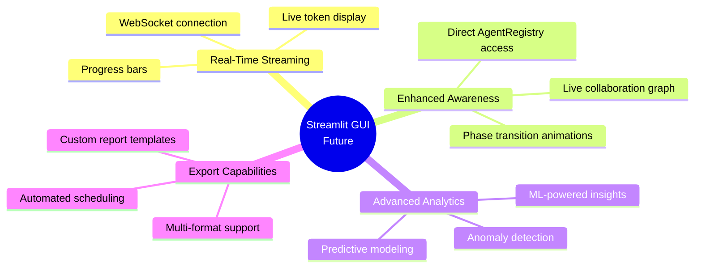

---

## Summary

The Streamlit GUI architecture provides a robust, safe, and performant monitoring layer for the Felix Framework:

**Key Achievements:**

- ✅ Zero interference with Felix core system
- ✅ Read-only safety enforced at multiple levels
- ✅ Absolute path resolution works from any directory
- ✅ Comprehensive error handling with graceful degradation
- ✅ Real-time data visualization with sub-second latency
- ✅ Dual-mode benchmarking (simulated and real components)
- ✅ Agent awareness integration with phase tracking
- ✅ Streaming support for real-time token display

**Design Principles:**

1. **Separation of Concerns**: Monitoring vs Control - each GUI has clear responsibilities
2. **Safety First**: Read-only by default with multiple enforcement layers
3. **Resilience**: Multiple fallback strategies ensure GUI always works
4. **Performance**: Caching and optimization for sub-second response times
5. **User Experience**: Informative errors and real-time feedback

---

**Document Version**: 4.1
**Architecture Status**: Production-Ready
**Last Validated**: 2025-10-22
