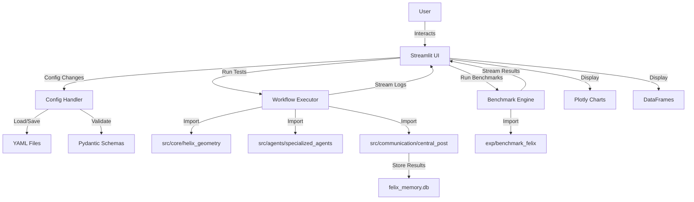

# Streamlit GUI Architecture for Felix Framework

**Version:** 2.0
**Target Users:** Technical developers familiar with Felix internals
**Deployment:** Local development machines only
**Last Updated:** 2025-10-17

> **Note:** This Streamlit GUI complements the existing tkinter GUI (`src/gui/`) and runs completely independently without modifying any existing code.

---

## 1. Overall Architecture Overview

### 1.1 High-Level Structure

The Streamlit GUI runs independently alongside the existing tkinter GUI, sharing the same `FelixSystem` backend for consistency. The architecture follows a modular design with clear separation of concerns:

```
┌─────────────────────────────────────────────────────────┐
│                   Streamlit Frontend                     │
│  ┌──────────┐  ┌──────────┐  ┌──────────┐  ┌─────────┐│
│  │Dashboard │  │  Config  │  │  Testing │  │Benchmark││
│  │   Tab    │  │   Tab    │  │   Tab    │  │   Tab   ││
│  └──────────┘  └──────────┘  └──────────┘  └─────────┘│
└──────────────────────┬──────────────────────────────────┘
                       │ Python Function Calls
                       ▼
┌─────────────────────────────────────────────────────────┐
│         Streamlit Backend Integration Layer              │
│  ┌────────────┐  ┌─────────────┐  ┌──────────────────┐ │
│  │System      │  │Config       │  │Benchmark         │ │
│  │Manager     │  │Handler      │  │Runner            │ │
│  └────────────┘  └─────────────┘  └──────────────────┘ │
└──────────────────────┬──────────────────────────────────┘
                       │ Wraps/Imports
                       ▼
┌─────────────────────────────────────────────────────────┐
│         Shared FelixSystem (src/gui/felix_system.py)     │
│  Provides unified interface to Felix core components     │
└──────────────────────┬──────────────────────────────────┘
                       │ Direct Imports
                       ▼
┌─────────────────────────────────────────────────────────┐
│              Felix Core Modules (src/)                   │
│  core/  agents/  communication/  memory/  llm/  pipeline/│
└─────────────────────────────────────────────────────────┘
```

**Key Design Principles:**
- **Non-Interference:** Completely separate from tkinter GUI (`src/gui/`)
- **Code Reuse:** Leverages existing `FelixSystem` class
- **Complementary:** Focuses on visualization and benchmarking strengths
- **Independent:** Can run simultaneously with tkinter GUI

### 1.2 Data Flow

**User Input → Backend Processing → UI Display:**

1. **Configuration Editing:**
   ```
   User edits config → Validate with Pydantic → Save to YAML → Reload backend
   ```

2. **Interactive Testing:**
   ```
   User defines test → Create agents & helix → Process workflow → Stream logs → Display results
   ```

3. **Benchmarking:**
   ```
   User selects params → Launch benchmark thread → Update progress bar → Plot results → Export CSV
   ```

### 1.3 Session State Management

Streamlit's session state will maintain:
- **Loaded configurations** (helix params, agent settings, LLM configs)
- **Active workflow instances** (running agents, CentralPost)
- **Test/benchmark results** (cached for re-display)
- **UI state** (selected tabs, expanded sections, filters)

```python
# Session state structure (pseudocode)
st.session_state = {
    'config': {...},  # Current configuration
    'workflow_status': 'idle',  # idle/running/completed
    'active_agents': [],  # List of agent instances
    'benchmark_results': pd.DataFrame(),
    'logs': [],  # Real-time log buffer
}
```

### 1.4 Component Interaction Diagram



---

## 2. Framework-Specific Recommendations and Setup

### 2.1 Why Streamlit is Ideal

**Pros:**
- **Rapid Prototyping:** Single Python file can create full GUI
- **Native Python Integration:** Direct import of Felix modules
- **Built-in Widgets:** `st.dataframe`, `st.plotly_chart` for data visualization
- **Auto-Rerun:** Changes reflected immediately (dev-friendly)
- **Minimal Dependencies:** Pure Python, no frontend framework needed
- **Session State:** Easy state management for technical users

**Cons:**
- **Limited Customization:** Harder to create custom UI components vs React/Vue
- **Performance:** Can struggle with >10MB datasets or 100+ agents in real-time
- **Single-User Focus:** Not designed for concurrent multi-user access (OK for local use)
- **Rerun Overhead:** Entire script re-executes on interaction

**For Felix:** Streamlit's pros outweigh cons because:
- Technical users don't need polished UI
- Local deployment avoids multi-user issues
- Direct Python integration simplifies backend calls
- Performance adequate for typical workflows (5-50 agents)

### 2.2 Dependencies

```bash
# requirements_streamlit.txt - Separate requirements file to avoid conflicts
streamlit>=1.28.0
plotly>=5.17.0
pandas>=2.0.0
pydantic>=2.4.0
pyyaml>=6.0
watchdog>=3.0.0  # For file monitoring

# Note: Felix core dependencies should already be installed
# If not, also install: openai, httpx, numpy, scipy
```

### 2.3 Basic App Structure

```
felix/
├── streamlit_app.py              # Main Streamlit entry point
├── streamlit_gui/                # Separate from src/gui to avoid conflicts with tkinter
│   ├── __init__.py
│   ├── pages/
│   │   ├── 1_🏠_Dashboard.py    # Overview & metrics
│   │   ├── 2_⚙️_Configuration.py # Config editor
│   │   ├── 3_🧪_Testing.py       # Interactive testing
│   │   └── 4_📊_Benchmarking.py  # Performance benchmarks
│   ├── components/
│   │   ├── config_editor.py     # Config widgets
│   │   ├── log_viewer.py        # Real-time logs
│   │   └── results_viz.py       # Visualization components
│   ├── backend/
│   │   ├── system_manager.py    # Wrapper around FelixSystem
│   │   ├── config_handler.py    # Config validation & I/O
│   │   └── benchmark_runner.py  # Benchmark execution
│   └── utils/
│       ├── validators.py        # Pydantic schemas
│       └── state_manager.py     # Session state helpers
├── src/gui/                      # Existing tkinter GUI (DO NOT MODIFY)
│   ├── main.py
│   ├── felix_system.py          # Shared FelixSystem class we'll import
│   └── ...
└── configs/
    ├── default_config.yaml
    └── user_configs/            # User-saved configs
```

### 2.4 Running Locally

```bash
# Activate Felix environment
source .venv/bin/activate  # or .venv\Scripts\activate on Windows

# Install Streamlit GUI dependencies (separate from tkinter GUI)
pip install -r requirements_streamlit.txt

# Launch Streamlit app
streamlit run streamlit_app.py

# Opens browser at http://localhost:8501

# Note: tkinter GUI can still be run separately with:
# python -m src.gui.main
```

### 2.5 Pain Points & Mitigations

#### Pain Point 1: Script Reruns on Every Interaction

**Problem:** Entire script re-executes, expensive for large data.

**Mitigation:**
```python
# Use @st.cache_data for expensive computations
@st.cache_data
def load_config(config_path: str):
    with open(config_path) as f:
        return yaml.safe_load(f)

# Use st.session_state to persist across reruns
if 'workflow_results' not in st.session_state:
    st.session_state.workflow_results = None
```

#### Pain Point 2: Real-Time Updates Not Native

**Problem:** Streamlit doesn't natively support WebSocket-style updates.

**Mitigation:**
```python
# Use st.empty() placeholder with manual refresh
status_placeholder = st.empty()
progress_bar = st.progress(0)

for i in range(100):
    # Update dynamically
    status_placeholder.text(f"Processing step {i+1}/100")
    progress_bar.progress((i+1)/100)
    time.sleep(0.1)
```

#### Pain Point 3: Large Datasets Slow Down UI

**Problem:** Displaying 10,000+ rows in `st.dataframe` causes lag.

**Mitigation:**
```python
# Paginate large datasets
ROWS_PER_PAGE = 100
page = st.number_input("Page", min_value=1, max_value=len(df)//ROWS_PER_PAGE+1)
st.dataframe(df.iloc[(page-1)*ROWS_PER_PAGE:page*ROWS_PER_PAGE])

# Or use lazy loading with st.data_editor
st.data_editor(df, num_rows="dynamic")
```

#### Pain Point 4: No Built-in State Persistence Across Sessions

**Problem:** Session state lost on browser refresh.

**Mitigation:**
```python
# Save state to disk periodically
import pickle

def save_session_state():
    with open('session_state.pkl', 'wb') as f:
        pickle.dump(st.session_state.to_dict(), f)

def load_session_state():
    if os.path.exists('session_state.pkl'):
        with open('session_state.pkl', 'rb') as f:
            return pickle.load(f)
    return {}
```

---

## 3. Key UI Components in Streamlit

### 3.1 Dashboard Overview

**Purpose:** High-level metrics and system status.

**Streamlit Widgets:**
```python
# Layout with columns
col1, col2, col3 = st.columns(3)

with col1:
    st.metric("Active Agents", 5, delta=2)
with col2:
    st.metric("Messages Processed", 1234, delta=123)
with col3:
    st.metric("Avg Confidence", "0.82", delta="0.05")

# Data overview
st.subheader("Recent Workflow Results")
st.dataframe(results_df, use_container_width=True)

# Memory summary
with st.expander("Memory System Status"):
    memory_summary = central_post.get_memory_summary()
    st.json(memory_summary)
```

**Pseudocode Example:**
```python
def render_dashboard(central_post, knowledge_store):
    st.title("Felix Framework Dashboard")
    
    # Metrics row
    metrics = central_post.get_performance_summary()
    col1, col2, col3, col4 = st.columns(4)
    col1.metric("Agents", metrics['active_connections'])
    col2.metric("Throughput", f"{metrics['message_throughput']:.1f} msg/s")
    col3.metric("Uptime", f"{metrics['uptime']/60:.0f} min")
    col4.metric("Memory Entries", get_memory_count(knowledge_store))
    
    # Recent activity
    st.subheader("Recent Activity")
    if st.session_state.get('recent_logs'):
        st.text_area("Logs", "\n".join(st.session_state.recent_logs[-10:]), height=200)
    
    # System health
    st.subheader("System Health")
    health_data = {
        'Component': ['Helix', 'Agents', 'Memory', 'LLM'],
        'Status': ['Healthy', 'Healthy', 'Healthy', 'Mock Mode'],
        'Last Check': [time.time()]*4
    }
    st.dataframe(pd.DataFrame(health_data))
```

### 3.2 Configuration Editor

**Purpose:** Edit all Felix configuration parameters with validation.

**Streamlit Widgets:**
```python
st.subheader("Helix Geometry")
col1, col2 = st.columns(2)
top_radius = col1.number_input("Top Radius", min_value=0.1, max_value=10.0, value=3.0, step=0.1)
bottom_radius = col2.number_input("Bottom Radius", min_value=0.1, max_value=10.0, value=0.5, step=0.1)

# JSON editor for advanced users
st.subheader("Raw Configuration (JSON)")
config_json = st.text_area("Edit JSON", value=json.dumps(config, indent=2), height=400)

# Validation feedback
if st.button("Validate Config"):
    try:
        validated_config = validate_config(json.loads(config_json))
        st.success("✓ Configuration is valid")
    except ValidationError as e:
        st.error(f"✗ Validation failed: {e}")
```

**Pseudocode Example:**
```python
def render_config_editor():
    st.title("Configuration Editor")
    
    # Load current config
    if 'config' not in st.session_state:
        st.session_state.config = load_default_config()
    
    config = st.session_state.config
    
    # Tabs for different config sections
    tab1, tab2, tab3, tab4 = st.tabs(["Helix", "Agents", "LLM", "Memory"])
    
    with tab1:
        st.subheader("Helix Geometry Parameters")
        config['helix']['top_radius'] = st.slider(
            "Top Radius", 0.5, 5.0, config['helix']['top_radius'], 0.1
        )
        config['helix']['bottom_radius'] = st.slider(
            "Bottom Radius", 0.1, 3.0, config['helix']['bottom_radius'], 0.1
        )
        config['helix']['height'] = st.slider(
            "Height", 1.0, 20.0, config['helix']['height'], 0.5
        )
        config['helix']['turns'] = st.number_input(
            "Turns", 1, 10, config['helix']['turns']
        )
    
    with tab2:
        st.subheader("Agent Spawning")
        config['spawning']['max_agents'] = st.number_input(
            "Max Agents", 1, 133, config['spawning']['max_agents']
        )
        config['spawning']['confidence_threshold'] = st.slider(
            "Confidence Threshold", 0.0, 1.0, 
            config['spawning']['confidence_threshold'], 0.05
        )
    
    with tab3:
        st.subheader("LLM Settings")
        config['llm']['token_budget'] = st.number_input(
            "Token Budget", 512, 8192, config['llm']['token_budget'], 128
        )
        config['llm']['strict_mode'] = st.checkbox(
            "Strict Mode", config['llm']['strict_mode']
        )
    
    with tab4:
        st.subheader("Memory Configuration")
        config['memory']['compression_ratio'] = st.slider(
            "Compression Ratio", 0.1, 0.9, 
            config['memory']['compression_ratio'], 0.05
        )
    
    # Save/Export buttons
    col1, col2, col3 = st.columns(3)
    if col1.button("Save Config"):
        save_config(config, "configs/user_configs/current.yaml")
        st.success("Config saved!")
    
    if col2.button("Export Config"):
        st.download_button(
            "Download YAML", 
            yaml.dump(config), 
            "felix_config.yaml"
        )
    
    if col3.button("Reset to Default"):
        st.session_state.config = load_default_config()
        st.rerun()
```

### 3.3 Interactive Testing

**Purpose:** Run complete workflows or test individual components.

**Streamlit Widgets:**
```python
st.subheader("Test Configuration")
test_mode = st.radio("Test Mode", ["Complete Workflow", "Component Isolation", "Step-by-Step"])

if test_mode == "Complete Workflow":
    query = st.text_input("Research Query", "Evaluate Python for modern software development")
    num_agents = st.slider("Number of Agents", 1, 20, 5)
    
    if st.button("Run Workflow"):
        with st.spinner("Running workflow..."):
            results = run_complete_workflow(query, num_agents)
        st.success("Workflow completed!")
        st.json(results)

elif test_mode == "Component Isolation":
    component = st.selectbox("Component", ["HelixGeometry", "ResearchAgent", "CentralPost"])
    # Component-specific testing UI
```

**Pseudocode Example:**
```python
def render_testing_interface():
    st.title("Interactive Testing")
    
    test_type = st.selectbox(
        "Test Type",
        ["Complete Workflow", "Agent Component", "Communication", "Memory"]
    )
    
    if test_type == "Complete Workflow":
        st.subheader("Complete Workflow Test")
        
        query = st.text_area("Research Query", 
            "Analyze the effectiveness of helical agent progression")
        
        col1, col2 = st.columns(2)
        num_agents = col1.number_input("Number of Agents", 1, 20, 5)
        max_time = col2.number_input("Max Time", 0.5, 5.0, 1.0, 0.1)
        
        if st.button("▶ Run Workflow", type="primary"):
            # Initialize components
            progress = st.progress(0)
            status = st.empty()
            log_area = st.empty()
            
            # Run workflow with real-time updates
            try:
                helix = create_helix_from_config(st.session_state.config)
                central_post = create_central_post(st.session_state.config)
                
                status.text("Initializing agents...")
                progress.progress(0.2)
                
                agents = spawn_agents(helix, num_agents)
                
                status.text("Processing workflow...")
                results = []
                for i, agent in enumerate(agents):
                    result = agent.process_task(query)
                    results.append(result)
                    progress.progress(0.2 + (i+1)/len(agents) * 0.8)
                    log_area.text_area("Logs", 
                        f"Agent {agent.agent_id} completed\n" + 
                        "\n".join(st.session_state.get('logs', [])), 
                        height=150)
                
                status.text("✓ Workflow completed!")
                progress.progress(1.0)
                
                # Display results
                st.subheader("Results")
                for i, result in enumerate(results):
                    with st.expander(f"Agent {i+1} - {result['agent_type']}"):
                        st.write(f"Confidence: {result['confidence']:.2f}")
                        st.text_area("Output", result['content'], height=100)
                
            except Exception as e:
                st.error(f"Workflow failed: {e}")
    
    elif test_type == "Agent Component":
        st.subheader("Agent Component Testing")
        
        agent_type = st.selectbox("Agent Type", 
            ["ResearchAgent", "AnalysisAgent", "SynthesisAgent", "CriticAgent"])
        
        spawn_time = st.slider("Spawn Time", 0.0, 1.0, 0.5, 0.05)
        test_task = st.text_input("Test Task", "Research topic X")
        
        if st.button("Test Agent"):
            agent = create_test_agent(agent_type, spawn_time)
            result = agent.process_task(test_task)
            st.json(result)
```

### 3.4 Performance Benchmarking

**Purpose:** Run benchmarks with configurable parameters and visualize results.

**Streamlit Widgets:**
```python
st.subheader("Benchmark Configuration")
benchmark_type = st.selectbox("Benchmark", [
    "Full Suite", "Helix Geometry", "Agent Lifecycle", 
    "Communication", "Memory", "Pipeline"
])

# Parameter overrides
with st.expander("Advanced Parameters"):
    num_iterations = st.number_input("Iterations", 1, 100, 10)
    num_agents = st.slider("Agent Count", 1, 100, 10)

if st.button("🚀 Run Benchmark"):
    progress = st.progress(0)
    results_placeholder = st.empty()
    
    # Run benchmark with progress updates
    for i, result in enumerate(run_benchmark(benchmark_type)):
        progress.progress((i+1)/num_iterations)
        results_placeholder.dataframe(result)

# Visualization
st.subheader("Results Visualization")
fig = px.line(results_df, x='agent_count', y='time_seconds', 
              title='Scaling Performance')
st.plotly_chart(fig)
```

**Pseudocode Example:**
```python
def render_benchmarking_interface():
    st.title("Performance Benchmarking")
    
    # Benchmark selection
    col1, col2 = st.columns([2, 1])
    with col1:
        benchmark_suite = st.selectbox("Benchmark Suite", [
            "Full Comprehensive Suite",
            "H1: Helical Adaptation",
            "H2: Communication Efficiency",
            "H3: Memory Compression",
            "Custom Scenario"
        ])
    
    with col2:
        if st.button("Load Previous Results"):
            load_benchmark_results()
    
    # Configuration
    with st.expander("Benchmark Parameters", expanded=True):
        col1, col2, col3 = st.columns(3)
        
        agent_counts = col1.multiselect(
            "Agent Counts", 
            [5, 10, 20, 50, 100], 
            default=[5, 10, 20]
        )
        iterations = col2.number_input("Iterations", 1, 10, 3)
        timeout = col3.number_input("Timeout (s)", 10, 300, 60)
    
    # Run benchmark
    if st.button("▶ Run Benchmark", type="primary"):
        st.session_state.benchmark_running = True
        st.session_state.benchmark_results = []
        
        # Progress tracking
        progress = st.progress(0)
        status = st.empty()
        chart_placeholder = st.empty()
        
        total_tests = len(agent_counts) * iterations
        current_test = 0
        
        for agent_count in agent_counts:
            for iter_num in range(iterations):
                status.text(f"Running: {agent_count} agents, iteration {iter_num+1}")
                
                # Run single benchmark
                result = run_single_benchmark(
                    benchmark_suite, 
                    agent_count, 
                    st.session_state.config
                )
                
                st.session_state.benchmark_results.append(result)
                
                # Update progress
                current_test += 1
                progress.progress(current_test / total_tests)
                
                # Live chart update
                df = pd.DataFrame(st.session_state.benchmark_results)
                fig = create_benchmark_chart(df)
                chart_placeholder.plotly_chart(fig)
        
        status.text("✓ Benchmark completed!")
        st.balloons()
    
    # Results display
    if st.session_state.get('benchmark_results'):
        st.subheader("Benchmark Results")
        
        results_df = pd.DataFrame(st.session_state.benchmark_results)
        
        # Metrics summary
        col1, col2, col3 = st.columns(3)
        col1.metric("Avg Time", f"{results_df['time_seconds'].mean():.3f}s")
        col2.metric("H1 Score", f"{results_df['h1_score'].mean():.3f}")
        col3.metric("H2 Score", f"{results_df['h2_score'].mean():.3f}")
        
        # Interactive visualizations
        tab1, tab2, tab3 = st.tabs(["Time vs Agents", "Hypothesis Scores", "Raw Data"])
        
        with tab1:
            fig = px.scatter(results_df, x='agent_count', y='time_seconds',
                           size='total_messages', color='component',
                           title='Execution Time vs Agent Count')
            st.plotly_chart(fig, use_container_width=True)
        
        with tab2:
            fig = px.bar(results_df, x='component', 
                        y=['h1_score', 'h2_score', 'h3_score'],
                        title='Hypothesis Validation Scores')
            st.plotly_chart(fig, use_container_width=True)
        
        with tab3:
            st.dataframe(results_df, use_container_width=True)
            st.download_button(
                "Download CSV",
                results_df.to_csv(index=False),
                "benchmark_results.csv"
            )
```

### 3.5 Real-Time Log Viewer

**Purpose:** Display live logs from workflow execution.

**Streamlit Widget:**
```python
# Create a log buffer in session state
if 'logs' not in st.session_state:
    st.session_state.logs = deque(maxlen=100)

# Display with auto-scroll
log_container = st.empty()

def append_log(message):
    st.session_state.logs.append(f"[{time.strftime('%H:%M:%S')}] {message}")
    log_container.text_area("Logs", "\n".join(st.session_state.logs), height=300)
```

**Pseudocode Example:**
```python
def render_log_viewer():
    st.subheader("Real-Time Logs")
    
    # Log filter controls
    col1, col2, col3 = st.columns([2, 1, 1])
    log_level = col1.selectbox("Level", ["ALL", "INFO", "WARNING", "ERROR"])
    auto_scroll = col2.checkbox("Auto-scroll", True)
    clear_logs = col3.button("Clear Logs")
    
    if clear_logs:
        st.session_state.logs = []
    
    # Filter logs
    filtered_logs = filter_logs(st.session_state.logs, log_level)
    
    # Display with custom styling
    log_text = "\n".join(filtered_logs[-50:])  # Last 50 entries
    st.text_area("", log_text, height=400, disabled=True)
    
    # Export option
    if st.button("Export Logs"):
        st.download_button(
            "Download Logs",
            "\n".join(filtered_logs),
            "felix_logs.txt"
        )
```

---

## 4. Integration Steps with Backend

### 4.1 Backend Module Structure

Create `streamlit_gui/backend/` with modules that wrap the existing FelixSystem:

```python
# streamlit_gui/backend/system_manager.py
"""
Wrapper around the existing FelixSystem class to provide
Streamlit-specific functionality without modifying the original.
"""
from src.gui.felix_system import FelixSystem, FelixConfig
import threading
import logging

logger = logging.getLogger(__name__)

class StreamlitSystemManager:
    """Manages FelixSystem instance for Streamlit GUI."""

    def __init__(self):
        self.felix_system = None
        self.is_running = False
        self._lock = threading.Lock()

    def start_system(self, config: dict = None):
        """Start Felix system with given configuration."""
        with self._lock:
            if self.is_running:
                return True

            # Convert dict config to FelixConfig
            felix_config = FelixConfig(
                lm_host=config.get('lm_host', '127.0.0.1'),
                lm_port=config.get('lm_port', 1234),
                helix_top_radius=config.get('helix', {}).get('top_radius', 3.0),
                helix_bottom_radius=config.get('helix', {}).get('bottom_radius', 0.5),
                helix_height=config.get('helix', {}).get('height', 8.0),
                helix_turns=config.get('helix', {}).get('turns', 2.0),
                max_agents=config.get('spawning', {}).get('max_agents', 15),
                base_token_budget=config.get('llm', {}).get('token_budget', 2048),
                enable_metrics=True,
                enable_memory=True,
                enable_dynamic_spawning=True
            )

            # Initialize FelixSystem
            self.felix_system = FelixSystem(felix_config)

            # Start the system
            if self.felix_system.start():
                self.is_running = True
                logger.info("FelixSystem started successfully via Streamlit")
                return True
            else:
                self.felix_system = None
                logger.error("Failed to start FelixSystem")
                return False

    def stop_system(self):
        """Stop the Felix system."""
        with self._lock:
            if self.felix_system:
                self.felix_system.stop()
                self.felix_system = None
                self.is_running = False
                logger.info("FelixSystem stopped")

    def get_status(self):
        """Get current system status."""
        if self.felix_system and self.is_running:
            return self.felix_system.get_system_status()
        return {"running": False, "agents": 0, "messages": 0}

    def run_workflow(self, query: str, num_agents: int = 5, callback=None):
        """Run a complete workflow using FelixSystem."""
        if not self.felix_system:
            raise RuntimeError("System not started")

        results = []

        # Spawn agents
        if callback:
            callback(0.1, "Spawning agents", [])

        agents = []
        for i in range(num_agents):
            agent_type = ["research", "analysis", "synthesis", "critic"][i % 4]
            agent = self.felix_system.spawn_agent(agent_type, f"domain_{i}")
            if agent:
                agents.append(agent)

        # Process tasks
        for i, agent in enumerate(agents):
            if callback:
                progress = 0.1 + (i+1)/len(agents) * 0.8
                callback(progress, f"Processing agent {i+1}", [])

            result = self.felix_system.send_task_to_agent(
                agent.agent_id,
                query
            )
            results.append(result)

        if callback:
            callback(1.0, "Complete", ["Workflow finished"])

        return results

# streamlit_gui/backend/config_handler.py
from pydantic import BaseModel, Field, validator
import yaml

class HelixConfig(BaseModel):
    top_radius: float = Field(gt=0, le=10)
    bottom_radius: float = Field(gt=0, le=10)
    height: float = Field(gt=0, le=50)
    turns: int = Field(ge=1, le=10)

    @validator('bottom_radius')
    def validate_radius_relationship(cls, v, values):
        if 'top_radius' in values and v >= values['top_radius']:
            raise ValueError('bottom_radius must be < top_radius')
        return v

class StreamlitFelixConfig(BaseModel):
    """Config schema for Streamlit GUI that maps to FelixConfig."""
    helix: HelixConfig
    spawning: dict
    llm: dict
    memory: dict
    lm_host: str = '127.0.0.1'
    lm_port: int = 1234

def load_config(path: str) -> StreamlitFelixConfig:
    with open(path) as f:
        data = yaml.safe_load(f)
    return StreamlitFelixConfig(**data)

def save_config(config: StreamlitFelixConfig, path: str):
    with open(path, 'w') as f:
        yaml.dump(config.dict(), f)
```

```python
# gui/backend/benchmark_runner.py
from exp.benchmark_felix import *
import threading
import queue

class BenchmarkRunner:
    def __init__(self):
        self.results_queue = queue.Queue()
        self.is_running = False
    
    def run_benchmark(self, benchmark_type: str, config: dict, callback=None):
        """
        Run benchmark suite with progress updates.
        
        Args:
            benchmark_type: Type of benchmark to run
            config: Configuration overrides
            callback: Progress callback function
        """
        self.is_running = True
        
        if benchmark_type == "full":
            tests = [test_helix_geometry, test_agent_lifecycle, 
                    test_communication, test_memory]
        elif benchmark_type == "h1":
            tests = [test_helix_geometry, test_agent_lifecycle]
        # ... more mappings
        
        results = []
        for i, test_func in enumerate(tests):
            if not self.is_running:
                break
            
            if callback:
                callback(i/len(tests), f"Running {test_func.__name__}", [])
            
            result = test_func()
            results.append(result)
            self.results_queue.put(result)
        
        if callback:
            callback(1.0, "Complete", [])
        
        self.is_running = False
        return results
    
    def stop_benchmark(self):
        """Stop running benchmark."""
        self.is_running = False
```

### 4.2 Direct Backend Integration Pattern

**Step 1:** Import the shared FelixSystem and wrap it:
```python
# In streamlit_app.py
import sys
import os
sys.path.insert(0, os.path.dirname(__file__))

from src.gui.felix_system import FelixSystem, FelixConfig
from streamlit_gui.backend.system_manager import StreamlitSystemManager
from streamlit_gui.backend.config_handler import load_config, save_config

# Create singleton system manager
@st.cache_resource
def get_system_manager():
    return StreamlitSystemManager()
```

**Step 2:** Use Streamlit callbacks to invoke backend:
```python
# Config page
if st.button("Apply Config"):
    config = load_config("configs/current.yaml")
    system_manager = get_system_manager()
    system_manager.stop_system()  # Stop if running
    system_manager.start_system(config.dict())
    st.success("Config applied and system restarted!")

# Testing page
if st.button("Run Test"):
    system_manager = get_system_manager()
    if not system_manager.is_running:
        st.error("Please start the system first")
    else:
        results = system_manager.run_workflow(query, num_agents=5)
        st.session_state.test_results = results
```

### 4.3 Handling Long-Running Tasks

**Problem:** Streamlit blocks UI during execution.

**Solution:** Use threading with placeholders:
```python
import threading
import time

def long_running_task(callback):
    for i in range(100):
        time.sleep(0.1)
        callback(i, f"Step {i}")

# In Streamlit
if st.button("Run"):
    progress = st.progress(0)
    status = st.empty()
    
    def update_ui(step, message):
        progress.progress(step/100)
        status.text(message)
    
    thread = threading.Thread(target=long_running_task, args=(update_ui,))
    thread.start()
    
    # Wait for completion (simplified)
    while thread.is_alive():
        time.sleep(0.1)
        st.rerun()  # Force UI update
```

**Better Solution:** Use asyncio (Streamlit 1.28+):
```python
import asyncio

async def async_workflow(query):
    helix = create_helix()
    agents = spawn_agents(helix, 5)
    
    results = []
    for agent in agents:
        result = await agent.process_task_async(query)
        results.append(result)
    
    return results

# In Streamlit
if st.button("Run Async"):
    results = asyncio.run(async_workflow(query))
    st.session_state.results = results
```

### 4.4 Data Serialization

**Configs:** YAML for human-readability
```python
def save_config(config_dict: dict, path: str):
    with open(path, 'w') as f:
        yaml.dump(config_dict, f, default_flow_style=False)
```

**Results:** JSON for structured data
```python
def save_results(results: list, path: str):
    with open(path, 'w') as f:
        json.dump(results, f, indent=2, default=str)
```

**Large Data:** Pickle for Python objects
```python
def save_workflow_state(central_post, path: str):
    with open(path, 'wb') as f:
        pickle.dump({
            'agents': central_post._registered_agents,
            'messages': central_post._processed_messages,
            'metrics': central_post.get_performance_summary()
        }, f)
```

### 4.5 Error Handling & User Feedback

```python
try:
    helix = HelixGeometry(
        top_radius=config['top_radius'],
        bottom_radius=config['bottom_radius'],
        height=config['height'],
        turns=config['turns']
    )
    st.success("✓ Helix created successfully")
except ValueError as e:
    st.error(f"✗ Invalid helix parameters: {e}")
except Exception as e:
    st.exception(e)
    st.error("Unexpected error occurred")
```

---

## 5. Best Practices for User Experience

### 5.1 Intuitive Navigation

**Sidebar Navigation:**
```python
# streamlit_app.py
st.set_page_config(page_title="Felix GUI", layout="wide", page_icon="🧬")

with st.sidebar:
    st.title("Felix Framework")
    st.markdown("---")
    
    page = st.radio("Navigate", [
        "🏠 Dashboard",
        "⚙️ Configuration",
        "🧪 Testing",
        "📊 Benchmarking"
    ])
    
    st.markdown("---")
    st.markdown("### Quick Actions")
    if st.button("Load Default Config"):
        load_default_config()
    if st.button("Reset Session"):
        clear_session_state()
```

**Breadcrumbs:**
```python
st.caption("Felix GUI > Configuration > Helix Parameters")
```

### 5.2 Responsive Design

**Columns for Side-by-Side:**
```python
col1, col2 = st.columns([2, 1])

with col1:
    # Main content
    st.dataframe(results)

with col2:
    # Sidebar content
    st.metric("Status", "Active")
    st.metric("Agents", 5)
```

**Expanders for Hierarchy:**
```python
with st.expander("Advanced Settings", expanded=False):
    temperature = st.slider("Temperature", 0.0, 2.0, 0.7)
    max_tokens = st.number_input("Max Tokens", 100, 4000, 2048)
```

**Tabs for Categories:**
```python
tab1, tab2, tab3 = st.tabs(["Overview", "Details", "Logs"])

with tab1:
    render_overview()
with tab2:
    render_details()
with tab3:
    render_logs()
```

### 5.3 Error Handling Best Practices

**Validation Feedback:**
```python
config_valid = True

if config['top_radius'] <= config['bottom_radius']:
    st.error("⚠ Top radius must be greater than bottom radius")
    config_valid = False

if config['height'] <= 0:
    st.error("⚠ Height must be positive")
    config_valid = False

if config_valid:
    st.success("✓ Configuration is valid")
```

**Graceful Degradation:**
```python
try:
    memory_summary = central_post.get_memory_summary()
    st.json(memory_summary)
except Exception as e:
    st.warning(f"Could not load memory summary: {e}")
    st.info("Continuing with limited functionality...")
```

### 5.4 Accessibility

**Alt Text for Charts:**
```python
fig = px.line(df, x='time', y='confidence', title='Confidence Over Time')
st.plotly_chart(fig, use_container_width=True, 
               alt_text="Line chart showing agent confidence decreasing from 0.8 to 0.3")
```

**Keyboard Navigation:**
```python
# Streamlit handles this by default, but ensure buttons are reachable via Tab
# Use button groups for related actions
col1, col2, col3 = st.columns(3)
col1.button("Previous")
col2.button("Next")
col3.button("Finish")
```

**Color Contrast:**
```python
st.markdown("""
<style>
.success-box {
    background-color: #d4edda;
    color: #155724;
    padding: 10px;
    border-radius: 5px;
}
.error-box {
    background-color: #f8d7da;
    color: #721c24;
    padding: 10px;
    border-radius: 5px;
}
</style>
""", unsafe_allow_html=True)
```

### 5.5 Performance Optimizations

**Caching:**
```python
@st.cache_data
def load_large_dataset(path: str):
    return pd.read_csv(path)

@st.cache_resource
def create_llm_client():
    return MockLMStudioClient()
```

**Lazy Loading:**
```python
# Don't load all data upfront
if st.button("Load Results"):
    st.session_state.results = load_benchmark_results()

# Only render when tab is active
if selected_tab == "Detailed Results":
    render_detailed_results()
```

**Pagination:**
```python
ITEMS_PER_PAGE = 50
page = st.number_input("Page", 1, len(items)//ITEMS_PER_PAGE+1, 1)
start = (page-1) * ITEMS_PER_PAGE
end = start + ITEMS_PER_PAGE
st.dataframe(items[start:end])
```

### 5.6 Local-Specific Optimizations

**File Upload/Download:**
```python
# Upload config
uploaded = st.file_uploader("Upload Config", type=['yaml', 'yml'])
if uploaded:
    config = yaml.safe_load(uploaded)
    st.session_state.config = config

# Download results
st.download_button(
    "Download Results",
    json.dumps(results, indent=2),
    "felix_results.json",
    "application/json"
)
```

**Local File Browser:**
```python
import os

config_dir = "configs/user_configs"
config_files = os.listdir(config_dir)
selected = st.selectbox("Load Config", config_files)

if st.button("Load"):
    config = load_config(os.path.join(config_dir, selected))
```

---

## 6. Review of Open-Source Examples

### 6.1 MLflow (ML Experiment Tracking)

**Website:** https://github.com/mlflow/mlflow

**Relevant GUI Features:**
- **Experiment Tracking UI:** Tabular view of runs with sortable columns
- **Metrics Visualization:** Line charts for training metrics over time
- **Parameter Comparison:** Side-by-side comparison of hyperparameters
- **Artifact Storage:** Download trained models and outputs

**Pros:**
- ✅ Clean, intuitive tabular layout for comparing experiments
- ✅ Real-time metric updates during training
- ✅ Flexible tagging and search functionality
- ✅ REST API for programmatic access

**Cons:**
- ❌ Heavy setup (requires database backend)
- ❌ Not well-suited for non-ML workflows
- ❌ Limited customization of dashboard

**Lessons for Felix GUI:**
- **Adopt:** Tabular comparison view for benchmarks (agent count vs time vs H1/H2/H3 scores)
- **Adopt:** Real-time metric streaming pattern (use `st.empty()` placeholders)
- **Avoid:** Complex backend setup—keep Felix GUI simple with file-based configs
- **Improve:** Add interactive filtering (MLflow's search is powerful but complex)

### 6.2 Weights & Biases (W&B) Dashboard

**Website:** https://wandb.ai

**Relevant GUI Features:**
- **Interactive Charts:** Plotly/Vega-based visualizations with zoom/pan
- **Run Comparison:** Multi-run overlay on single chart
- **System Metrics:** CPU/GPU/Memory tracking during runs
- **Report Generation:** Create shareable reports with markdown + charts

**Pros:**
- ✅ Beautiful, responsive visualizations
- ✅ Excellent real-time performance monitoring
- ✅ Collaborative features (comments, tags)
- ✅ Report generation with code/results

**Cons:**
- ❌ Cloud-first design (self-hosted version is complex)
- ❌ Overkill for simple workflows
- ❌ Steep learning curve for non-ML users

**Lessons for Felix GUI:**
- **Adopt:** Multi-line chart overlays for comparing runs (5 agents vs 50 agents on same chart)
- **Adopt:** System metrics sidebar (show active agents, memory usage, throughput)
- **Avoid:** Cloud dependency—keep Felix purely local
- **Improve:** Simplify interface for technical users (W&B optimizes for teams/sharing)

### 6.3 Apache Superset (Data Visualization)

**Website:** https://github.com/apache/superset

**Relevant GUI Features:**
- **SQL Lab:** Interactive query editor with result visualization
- **Dashboard Builder:** Drag-and-drop dashboard creation
- **Chart Types:** 50+ visualization options
- **Data Export:** CSV/Excel/JSON export

**Pros:**
- ✅ Powerful data exploration capabilities
- ✅ Extensive chart library
- ✅ Role-based access control

**Cons:**
- ❌ Complex setup (PostgreSQL/Redis required)
- ❌ Dashboards are static (no real-time updates without refresh)
- ❌ Designed for BI teams, not developers

**Lessons for Felix GUI:**
- **Adopt:** Flexible chart selection (let users choose scatter/line/bar for benchmarks)
- **Adopt:** Data export in multiple formats (CSV, JSON)
- **Avoid:** Static dashboard paradigm—Felix needs real-time updates
- **Improve:** Lightweight setup with Streamlit vs Superset's heavy stack

### 6.4 Streamlit Gallery Examples

**Website:** https://streamlit.io/gallery

#### Example A: "LLM Monitoring Dashboard"

**Features:**
- Real-time token usage tracking
- Model performance metrics (latency, throughput)
- Cost estimation

**Pros:**
- ✅ Clean, simple layout
- ✅ Effective use of `st.metric()` for KPIs
- ✅ Good color coding (red/yellow/green for status)

**Cons:**
- ❌ No historical trend analysis
- ❌ Limited interactivity

**Lessons for Felix:**
- **Adopt:** `st.metric()` for key stats (active agents, msg/s, confidence)
- **Adopt:** Color-coded status indicators
- **Improve:** Add historical trend charts (confidence over time)

#### Example B: "A/B Test Analyzer"

**Features:**
- Parameter comparison table
- Statistical significance testing
- Interactive filtering

**Pros:**
- ✅ Side-by-side comparison is intuitive
- ✅ Export functionality
- ✅ Good use of tabs

**Cons:**
- ❌ No real-time data collection
- ❌ Limited to two variants

**Lessons for Felix:**
- **Adopt:** Side-by-side agent comparison (compare research vs synthesis output)
- **Adopt:** Statistical analysis (confidence intervals for benchmarks)
- **Improve:** Support N-way comparison (not just A/B)

### 6.5 JupyterLab (Notebook Interface)

**Website:** https://github.com/jupyterlab/jupyterlab

**Relevant GUI Features:**
- **Notebook Paradigm:** Cell-based execution
- **Variable Inspector:** View current state
- **Extension System:** Customizable widgets

**Pros:**
- ✅ Familiar to data scientists
- ✅ Excellent for exploratory workflows
- ✅ Rich output support (plots, tables, HTML)

**Cons:**
- ❌ Non-linear execution is confusing for structured workflows
- ❌ State management is error-prone
- ❌ Not suitable for non-technical users

**Lessons for Felix GUI:**
- **Avoid:** Notebook paradigm—Felix workflows are sequential, not exploratory
- **Adopt:** Variable inspector concept (show session state for debugging)
- **Improve:** Streamlit's top-to-bottom execution is clearer for workflows

### 6.6 Great Expectations (Data Quality UI)

**Website:** https://github.com/great-expectations/great_expectations

**Relevant GUI Features:**
- **Data Docs:** Auto-generated validation reports
- **Expectation Suites:** Configurable validation rules
- **Profiling:** Automatic data profiling

**Pros:**
- ✅ Excellent validation feedback (pass/fail with details)
- ✅ Clear error messages
- ✅ HTML reports are shareable

**Cons:**
- ❌ Primarily static reports (no interactive editing)
- ❌ CLI-heavy workflow

**Lessons for Felix GUI:**
- **Adopt:** Validation feedback pattern (show which config fields pass/fail)
- **Adopt:** Auto-generated reports (benchmark summary as HTML export)
- **Improve:** Make validation interactive in Streamlit (vs static HTML)

### 6.7 Synthesis of Lessons

| Feature | Best Example | Implement in Felix |
|---------|-------------|-------------------|
| Real-time metrics | W&B Dashboard | Use `st.metric()` + `st.empty()` for live updates |
| Experiment comparison | MLflow UI | Tabular benchmark comparison with sorting/filtering |
| Interactive charts | W&B, Streamlit Gallery | Plotly charts with zoom/pan/hover |
| Config validation | Great Expectations | Pydantic + visual pass/fail indicators |
| Export functionality | Superset | Multi-format export (CSV, JSON, YAML) |
| System monitoring | W&B | Sidebar with agent count, memory usage, throughput |
| Error handling | Great Expectations | Clear error messages with remediation suggestions |
| Navigation | MLflow | Sidebar navigation + breadcrumbs |

**Key Avoidances:**
- ❌ Complex backend setup (Superset, MLflow)
- ❌ Cloud-first design (W&B)
- ❌ Non-linear execution (JupyterLab)
- ❌ Static dashboards (Superset)

**Key Innovations for Felix:**
- ✅ **Helix-specific visualizations:** 3D helix path plot showing agent positions
- ✅ **Hypothesis-focused metrics:** Dedicated H1/H2/H3 score tracking
- ✅ **Component isolation testing:** Test individual Felix modules (no equivalent in examples)
- ✅ **Local-first design:** No server setup, just `streamlit run`

---

## Implementation Roadmap

### Phase 1: Core Infrastructure (Day 1-2)
- [ ] Create `streamlit_gui/` directory structure (separate from `src/gui/`)
- [ ] Set up `streamlit_app.py` entry point
- [ ] Create `StreamlitSystemManager` wrapper around `FelixSystem`
- [ ] Implement Pydantic schemas for config validation
- [ ] Build basic dashboard with system status display
- [ ] Test integration with existing `FelixSystem` class

### Phase 2: Configuration Editor (Day 3-4)
- [ ] Build helix parameter editor with interactive sliders
- [ ] Add agent spawning config UI
- [ ] Implement LLM settings editor (host/port for LM Studio)
- [ ] Add memory configuration controls
- [ ] Create YAML save/load/export functionality
- [ ] Add visual feedback for helix geometry changes

### Phase 3: Testing Interface (Day 5-6)
- [ ] Implement workflow runner using `FelixSystem.run_workflow()`
- [ ] Add component isolation testing
- [ ] Build real-time log viewer with `st.empty()` placeholders
- [ ] Create results visualization (confidence scores, agent outputs)
- [ ] Add progress tracking for long-running workflows

### Phase 4: Benchmarking (Day 7-8)
- [ ] Integrate with `exp/benchmark_felix.py`
- [ ] Build benchmark parameter selection UI
- [ ] Implement real-time progress tracking
- [ ] Create Plotly-based interactive visualizations
- [ ] Add H1/H2/H3 hypothesis validation charts
- [ ] Enable CSV export and comparison features

### Phase 5: Polish & Documentation (Day 9-10)
- [ ] Add comprehensive error handling
- [ ] Implement session state persistence
- [ ] Create in-app user guide
- [ ] Optimize performance with `@st.cache_data` and `@st.cache_resource`
- [ ] Add requirements_streamlit.txt file
- [ ] Test coexistence with tkinter GUI

---

## Technical Specifications Summary

**Language:** Python 3.8+
**Framework:** Streamlit 1.28+
**Key Dependencies:**
- streamlit, plotly, pandas, pydantic, pyyaml
- Existing Felix modules (src/)
- Shared FelixSystem class (src/gui/felix_system.py)

**File Structure:**
```
streamlit_app.py              # Entry point
streamlit_gui/                # Separate from src/gui (tkinter)
├── pages/                    # Multi-page sections
├── components/               # Reusable UI components
├── backend/                  # Wrappers around FelixSystem
└── utils/                    # Helpers
configs/                      # YAML configs
requirements_streamlit.txt   # Separate requirements file
```

**Integration Approach:**
- Import and wrap existing `FelixSystem` class
- No modifications to tkinter GUI (`src/gui/`)
- Separate directory structure (`streamlit_gui/`)
- Can run simultaneously with tkinter GUI

**Key Design Patterns:**
- `@st.cache_resource` for singleton FelixSystem
- Session state for UI persistence
- Threading for long-running tasks
- Pydantic for config validation
- Callback pattern for progress updates

**Performance Targets:**
- Config validation: <100ms
- Small workflow (5 agents): <10s
- Large workflow (50 agents): <60s
- Benchmark suite: <5min
- UI responsiveness: <200ms for interactions

---

## Conclusion

This updated architecture provides a **complementary Streamlit GUI** that works alongside the existing tkinter GUI without any interference. Key strengths:

1. **Non-Invasive Integration:** Reuses existing `FelixSystem` class without modifying any tkinter code
2. **Complementary Focus:** Streamlit excels at visualization/benchmarking, tkinter at direct control
3. **Independent Operation:** Can run both GUIs simultaneously on different ports
4. **Shared Backend:** Both GUIs use the same `FelixSystem` for consistency
5. **Clean Separation:** Separate directories (`streamlit_gui/` vs `src/gui/`) prevent conflicts

**GUI Comparison:**
| Feature | Tkinter GUI | Streamlit GUI |
|---------|-------------|---------------|
| **Best For** | Direct agent control, real-time interaction | Visualization, benchmarking, analysis |
| **Interface** | Desktop native | Web-based (localhost:8501) |
| **Strengths** | Fast response, native widgets | Better charts, easier data export |
| **Target Users** | Developers needing control | Developers needing insights |

The design maintains all the original benefits (MLflow-style tracking, W&B visualization patterns) while ensuring zero impact on the existing tkinter implementation.

**Next Steps:** Implement Phase 1 (core infrastructure) starting with the `streamlit_gui/` directory structure and `StreamlitSystemManager` wrapper.